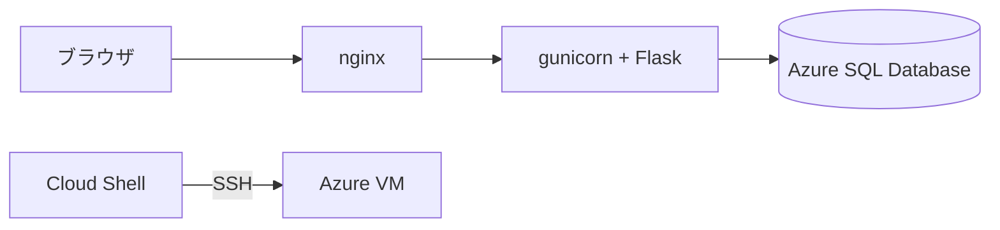

# 作りながら覚える Microsoft Azure 入門講座（IaaS 編）

Udemy コース「[作りながら覚える Microsoft Azure 入門講座（IaaS 編）](https://www.udemy.com/course/microsoft-azure-iaas-part/)」の教材リポジトリです。

**補足資料・コース内ラボ・Todo アプリ・デプロイスクリプトの 4 つが入っています。**

## 目的別の入口

| やりたいこと                             | 場所                                                                                |
| ---------------------------------------- | ----------------------------------------------------------------------------------- |
| 動画で出てきたコマンドや参考サイトを見る | [`reference/`](reference/README.md)                                                 |
| コース内ラボの演習環境を作る             | [`labs/`](labs/README.md)                                                           |
| Todo アプリを自分の環境に構築する        | [`docs/build-todo-app.md`](docs/build-todo-app.md)                                  |
| VM 上のアプリを更新する                  | [`deploy/README.md`](deploy/README.md)                                              |
| うまく動かないときの対処を探す           | [`docs/troubleshooting.md`](docs/troubleshooting.md)                                |
| アプリの仕様を知る                       | [`docs/requirements.md`](docs/requirements.md) / [`docs/design.md`](docs/design.md) |

## Todo アプリについて

**インフラが正しく動いているかを目で確かめるための、できるだけ小さな題材です。** タスクの一覧・追加・完了状態の変更・削除ができます。ログイン認証はありません。



VM では nginx がブラウザからの要求を受け、gunicorn へ転送します。**gunicorn は Flask アプリを常駐させる WSGI サーバーです。** Flask に付属する開発用サーバーは本番向けではないため、VM では使いません。

**画面の下端に、応答した VM のホスト名とプライベート IP、接続先のデータベース名が出ます。** ロードバランサやスケールセットの章で、どの VM が応答したかを見分けるための表示です。

> [!CAUTION]
> このアプリにはログイン認証がありません。URL に到達した人は誰でもタスクを追加・削除できます。
> 動作確認用のタスク以外を入力せず、**確認が終わったらリソースグループごと削除してください。**

## ディレクトリ構成

```text
.
├── reference/   # 補足資料（セクションごとのコマンド集・参考サイト）
├── labs/        # コース内ラボ（手順書と Terraform）
│   ├── modules/ #   全ラボで共有する Terraform モジュール
│   └── sections/
├── src/         # Todo アプリのソースコード
├── deploy/      # VM の中へアプリを配置するスクリプト
├── docs/        # アプリの仕様と構築手順
└── scripts/     # ラボ共通の起動処理と検証
```

**置き場所で役割が決まります。**

| 場所         | 答える問い                               |
| ------------ | ---------------------------------------- |
| `reference/` | セクションで出てきた用語とコマンドは何か |
| `labs/`      | コース内ラボで何をするか                 |
| `docs/`      | どう作られているか / どうすれば動くか    |
| `deploy/`    | VM の中へどう配置するか                  |

## 関連リポジトリ

| リポジトリ                                                                   | 内容                   |
| ---------------------------------------------------------------------------- | ---------------------- |
| [udemy-in-course-labs](https://github.com/m-oka-system/udemy-in-course-labs) | 他コースのコース内ラボ |
| [python-flask-mysql-todo](https://github.com/m-oka-system/python-flask-mysql-todo) | 移植元の Todo アプリ（MySQL 版） |
| [udemy-azure-iaas](https://github.com/m-oka-system/udemy-azure-iaas)         | 旧版の補足資料         |
