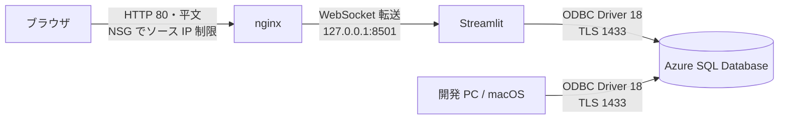

# Streamlit + Azure SQL Database で作る Todo アプリ

Udemy コース「作りながら覚える Microsoft Azure 入門講座（IaaS 編）」の教材です。Streamlit で書いた Todo アプリを、開発 PC（macOS）と Azure VM（Ubuntu 24.04 LTS）の両方で動かします。

タスクの一覧・追加・完了状態の変更・削除ができます。ログイン認証はありません。

## 全体構成

ブラウザから Azure SQL Database までの経路です。



開発 PC と Azure VM は、同じ Azure SQL Database に接続します。データベースは 1 つだけ作ります。

## ファイル構成

| ファイル                 | 役割                                         |
| ------------------------ | -------------------------------------------- |
| `app.py`                 | アプリ本体。1 ファイルで完結します           |
| `schema.sql`             | テーブル定義。管理者が一度だけ実行します     |
| `pyproject.toml`         | 依存パッケージの定義                         |
| `uv.lock`                | 依存パッケージのバージョン固定               |
| `.python-version`        | Python のバージョン（3.12）                  |
| `.env.sample`            | 接続情報のテンプレート                       |
| `.streamlit/config.toml` | 待ち受けアドレスとエラー表示の設定           |
| `deploy/setup.sh`        | VM のセットアップを 1 本にまとめたスクリプト |
| `deploy/todo.service`    | systemd unit（Streamlit を常駐させます）     |
| `deploy/todo.nginx.conf` | nginx の設定（リバースプロキシ）             |

接続情報を書く `.env` は `.gitignore` の対象です。リポジトリにコミットしないでください。

## ローカル実行手順

開発 PC（macOS）でアプリを動かすまでの手順です。上から順に実行してください。

### 前提条件

| 項目                     | 内容                                 |
| ------------------------ | ------------------------------------ |
| OS                       | macOS                                |
| Homebrew                 | 導入済みであること                   |
| Azure サブスクリプション | Azure ポータルにサインインできること |

### 1. uv の導入

uv は Python のパッケージ管理ツールです。バージョンを固定して導入します。Azure VM 側でも同じバージョンを使うため、環境の差が出ません。

```bash
curl -LsSf https://astral.sh/uv/0.9.18/install.sh | sh
```

導入できたことを確認します。

```bash
uv --version
```

### 2. ODBC Driver 18 の導入

Python から SQL Server へ接続するためのドライバです。あわせて `sqlcmd`（`mssql-tools18`）も導入します。テーブルの作成に使います。

```bash
brew tap microsoft/mssql-release https://github.com/Microsoft/homebrew-mssql-release
brew install msodbcsql18 mssql-tools18
```

導入できたことを確認します。

```bash
odbcinst -q -d
```

次のように表示されれば成功です。

```text
[ODBC Driver 18 for SQL Server]
```

### 3. 依存パッケージのインストール

リポジトリのルートで実行します。`uv.lock` に固定されたバージョンがそのまま入ります。

```bash
uv sync
```

Python 3.12 が使われていることを確認します。

```bash
uv run python -V
```

### 4. Azure SQL Database の作成

Azure ポータルで作成します。**無料オファーの設定を 1 か所だけ間違えると課金されます。** 下の項目 4 を必ず確認してください。

1. 「SQL データベース」から新規作成を開始します
2. リソースグループとデータベース名（例: `todo`）を指定します
3. サーバーを新規作成します。認証方法は **SQL 認証** を選び、サーバー管理者ログインのユーザー名とパスワードを控えます
4. コンピューティングとストレージで **サーバーレス** を選び、**無料オファーを適用します**。「制限に達したとき」の動作は **「データベースを自動一時停止する」** を選びます

   > 「課金して継続」を選ぶと、無料枠を超えた分が課金されます。しかも**同一の請求期間内は無料枠に戻せません。**

5. 自動一時停止の遅延は既定の **60 分** のままにします
6. ネットワークの設定でパブリックエンドポイントを有効にし、「**現在のクライアント IP アドレスを追加する**」を「はい」にします
7. 作成を完了します

このサーバー管理者ログインを、アプリの接続にもそのまま使います。アプリ専用のユーザーは作りません。

### 5. テーブルの作成

`schema.sql` を実行して `dbo.todos` テーブルを作ります。**アプリはテーブルを自動作成しません。** 複数の VM が同時に起動したときに競合するためです。

リポジトリのルートで実行します。

```bash
sqlcmd -S <サーバー名>.database.windows.net -d todo -U <管理者ユーザー> -i schema.sql
```

パスワードは非表示のプロンプトで尋ねられます。`-P` オプションは使いません。**パスワードがシェルの履歴とプロセス一覧に残るためです。**

テーブルができたことを確認します。

```bash
sqlcmd -S <サーバー名>.database.windows.net -d todo -U <管理者ユーザー> \
    -Q "SELECT COUNT(*) FROM dbo.todos"
```

### 6. 接続情報の設定

テンプレートをコピーして `.env` を作ります。

```bash
cp .env.sample .env
```

`.env` を開き、手順 4 で控えた値を記入します。

```text
DB_HOST=<サーバー名>.database.windows.net
DB_NAME=todo
DB_USER=<管理者ユーザー>
DB_PASSWORD=<パスワード>
```

パスワードに `@` や `:` が含まれていても、そのまま記入して問題ありません。アプリ側で正しくエスケープします。

### 7. アプリの起動

```bash
uv run streamlit run app.py
```

ブラウザで <http://localhost:8501> を開きます。タスクを追加して、一覧に表示されれば成功です。

停止するときは、起動したターミナルで `Ctrl + C` を押します。

## Azure デプロイ手順

Azure VM（Ubuntu 24.04 LTS）にアプリを配置して公開します。**ローカル実行手順の手順 4 から 6 まで（Azure SQL Database の作成、テーブルの作成、接続情報の確認）を先に終わらせてください。**

### 検証済みの構成

| 項目             | 値                                              |
| ---------------- | ----------------------------------------------- |
| OS イメージ      | Ubuntu Server 24.04 LTS                         |
| VM サイズ        | `Standard_F1as_v7`                              |
| 管理者ユーザー名 | `azureuser`                                     |
| 認証の種類       | SSH 公開キー                                    |
| NSG（受信規則）  | 22/tcp と 80/tcp を自分のグローバル IP のみ許可 |

### 1. Azure VM の作成

Azure ポータルで仮想マシンを作成します。

1. イメージに **Ubuntu Server 24.04 LTS** を選びます
2. サイズは `Standard_F1as_v7` を選びます
3. 管理者アカウントの認証の種類は **SSH 公開キー**、ユーザー名は `azureuser` にします
4. キーペアを新規作成し、秘密鍵ファイル（`ssh-key.pem`）をダウンロードします。**再ダウンロードはできません**
5. 受信ポートは **HTTP (80)** と **SSH (22)** を許可します
6. 作成後、NSG の受信規則を編集し、22/tcp と 80/tcp の**ソースを自分のグローバル IP アドレスだけ**に絞ります

自分のグローバル IP アドレスは、開発 PC で次のコマンドを実行すると分かります。

```bash
curl -s https://ifconfig.me
```

このアプリにはログイン認証がありません。**NSG のソース IP 制限が唯一のアクセス制御です。** `Any` のまま公開しないでください。

### 2. 秘密鍵の権限設定

ダウンロードした秘密鍵を `~/.ssh/` へ移動し、**所有者だけが読める権限にします。**

```bash
mv ~/Downloads/ssh-key.pem ~/.ssh/ssh-key.pem
chmod 400 ~/.ssh/ssh-key.pem
```

**この手順を飛ばすと SSH が鍵を受け付けません。** ダウンロード直後のファイルは他のユーザーからも読める権限になっており、SSH は「保護されていない鍵」とみなして接続を拒否します。

### 3. SSH 接続の確認

```bash
ssh -i ~/.ssh/ssh-key.pem azureuser@<VM のパブリック IP>
```

`<VM のパブリック IP>` は、Azure ポータルの仮想マシンの概要ページで確認できます。初回は接続先の確認を求められるので `yes` と入力します。

### 4. VM の送信元 IP アドレスの確認

**SSH で VM に接続した状態で**実行します。VM が Azure SQL Database へ接続するときの送信元 IP アドレスを調べます。

```bash
curl -s https://ifconfig.me
```

表示された IP アドレスを控えます。**VM のパブリック IP とは異なる場合があります。**

### 5. Azure SQL Database のファイアウォール規則の追加

Azure ポータルで SQL サーバーの「ネットワーク」を開き、ファイアウォール規則に**手順 4 で控えた IP アドレス**を追加して保存します。

**この手順を飛ばすと、接続情報が正しくてもデータベースに到達できません。** アプリの画面には「データベースに接続できません」とだけ表示され、原因が分かりません。

### 6. ファイルの転送

**開発 PC のターミナル**（SSH を抜けた状態）で、リポジトリのルートから実行します。

```bash
COPYFILE_DISABLE=1 tar czf - \
    app.py schema.sql pyproject.toml uv.lock .python-version .env.sample \
    .streamlit/config.toml deploy \
    | ssh -i ~/.ssh/ssh-key.pem azureuser@<VM のパブリック IP> \
        "mkdir -p ~/todo-src && tar xzf - -C ~/todo-src"
```

転送するのは次のファイルとディレクトリだけです。`.env` は転送しません。接続情報は VM 上で記入します。

| 対象                     | 用途                             |
| ------------------------ | -------------------------------- |
| `app.py`                 | アプリ本体                       |
| `schema.sql`             | テーブル定義（参照用）           |
| `pyproject.toml`         | 依存パッケージの定義             |
| `uv.lock`                | バージョン固定                   |
| `.python-version`        | Python のバージョン              |
| `.env.sample`            | 接続情報のテンプレート           |
| `.streamlit/config.toml` | Streamlit の設定                 |
| `deploy/`                | セットアップスクリプトと設定一式 |

#### COPYFILE_DISABLE=1 が必要な理由

macOS の `tar` は、拡張属性を保存するために `._app.py` のような **AppleDouble ファイル**を書庫へ混ぜます。`COPYFILE_DISABLE=1` を付けないと、VM 側に `._` で始まる不要なファイルが並びます。動作は止まりませんが、`ls` の結果が分かりにくくなります。

### 7. セットアップスクリプトの実行

再び SSH で VM へ接続し、実行します。

```bash
ssh -i ~/.ssh/ssh-key.pem azureuser@<VM のパブリック IP>
sudo ~/todo-src/deploy/setup.sh
```

スクリプトは次の作業をまとめて行います。完了まで数分かかります。

1. ODBC Driver 18 と `mssql-tools18` の導入
2. nginx の導入
3. uv の導入（`/usr/local/bin/uv`）
4. 実行ユーザー `todo` の作成とアプリの `/opt/todo` への配置
5. 依存パッケージのインストール
6. systemd サービスの登録と起動
7. nginx の設定と起動

最後に「セットアップが完了しました」と表示され、次に行う手順の一覧が出ます。**そのうち送信元 IP の確認とファイアウォール規則の追加は、手順 4 と手順 5 で済ませています。**

### 8. 接続情報の記入

`/opt/todo/.env` に、ローカル実行手順の手順 6 と同じ内容を記入します。

```bash
sudo -u todo nano /opt/todo/.env
```

保存は `Ctrl + O` → `Enter`、終了は `Ctrl + X` です。

`.env` の所有者は `todo`、パーミッションは 600 です。接続情報を含むため、アプリの実行ユーザーだけが読める状態にしています。**`sudo -u todo` を付けて `todo` ユーザーとして編集してください。** 所有者とパーミッションを保ったまま書き換えられます。

### 9. サービスの再起動

`.env` は起動時に読み込まれるため、記入したら再起動します。

```bash
sudo systemctl restart todo
```

起動したことを確認します。

```bash
systemctl status todo
```

`Active: active (running)` と表示されれば成功です。

### 10. ブラウザからの確認

```text
http://<VM のパブリック IP>
```

タスクの追加、完了状態の変更、削除がすべて動作すれば完了です。

**初回の表示に 1 分ほどかかる場合があります。** 異常ではありません。理由はトラブルシュートの「初回アクセスが遅い」を参照してください。

### VM 再起動後の動作

systemd に登録済みのため、VM を再起動してもアプリは自動的に復帰します。手動での起動操作は不要です。

## トラブルシュート

### まず実行するコマンド

**アプリの画面にはエラーの詳細を表示しません。** ODBC のエラーメッセージにはサーバー名やユーザー名が含まれるためです。原因はサーバーのログでしか分かりません。

VM 上で次のコマンドを実行してください。

| 目的                 | コマンド                     | 期待する結果                     |
| -------------------- | ---------------------------- | -------------------------------- |
| ログの確認           | `sudo journalctl -u todo -f` | 例外のトレースバックが確認できる |
| サービスの状態確認   | `systemctl status todo`      | `Active: active (running)`       |
| 待ち受けアドレス確認 | `sudo ss -ltnp \| grep 8501` | `127.0.0.1:8501` になっている    |
| nginx の状態確認     | `systemctl status nginx`     | `Active: active (running)`       |

`journalctl -f` は新しいログを表示し続けます。**ログを見ながらブラウザを操作すると、どの操作で何が起きたかが分かります。** 終了は `Ctrl + C` です。

待ち受けが `0.0.0.0:8501` になっている場合、`/opt/todo/.streamlit/config.toml` が読まれていません。認証のないアプリが nginx を経由せずに公開されている状態です。ファイルの配置と `todo.service` の `WorkingDirectory` を確認してください。

### 初回アクセスが遅い

**原因** — Azure SQL Database のサーバーレス構成は、60 分間の無操作で自動的に一時停止します。停止中のデータベースへ接続すると、エラー 40613（データベースが利用できません）が返ります。

**影響** — アプリは 15 秒間隔で最大 5 回まで接続をやり直します。その間は「データベースに接続しています。停止状態からの復帰には最大 1 分かかります。」と表示されます。**復帰にはおよそ 1 分かかります。**

**対処** — 待ってください。異常ではありません。実機での検証中にも 2 回発生しました。1 分以上待っても復帰しない場合は、次項の「データベースに接続できません」を確認してください。

自動一時停止は意図した設計です。停止しない構成にすると接続が保持され続け、無料枠（毎月 10 万 vCore 秒）を **1.7 日ほどで使い切ります。**

### 「データベースに接続できません」と表示される

画面に次のメッセージが出た場合です。

```text
データベースに接続できません。接続情報とファイアウォール規則を確認してください。
```

原因は 4 つ考えられます。上から順に確認してください。

| 順  | 原因                             | 確認方法                                         | 対処                                            |
| --- | -------------------------------- | ------------------------------------------------ | ----------------------------------------------- |
| 1   | ファイアウォール規則に IP がない | 接続元で `curl -s https://ifconfig.me`           | 表示された IP を SQL サーバーの規則へ追加します |
| 2   | `.env` の記入誤り                | `sudo journalctl -u todo -n 50 --no-pager`       | サーバー名・ユーザー名・パスワードを修正します  |
| 3   | データベースが停止中             | 画面に接続中の表示が出る                         | 1 分ほど待ちます（前項を参照）                  |
| 4   | 無料 vCore 秒の枯渇              | Azure ポータルでデータベースの使用量を確認します | **翌月まで復旧しません**                        |

**原因 3 と原因 4 は、どちらも同じエラー 40613 を返します。** 無操作による停止は次の接続で再開しますが、枯渇による停止は**その月の残りは再開しません。** 何度やり直しても復旧しない場合は、使用量を確認してください。

接続情報を直したあとは、画面の「再接続」ボタンを押してください。ボタンを押すと `.env` を読み直します。**アプリの再起動は不要です。** VM 上で `/opt/todo/.env` を直した場合も同じです。

画面そのものが表示されない場合は、サービスを再起動してからログを確認します。

```bash
sudo systemctl restart todo
sudo journalctl -u todo -n 50 --no-pager
```

### 「テーブル dbo.todos がありません」と表示される

**原因** — `schema.sql` を実行していません。**アプリはテーブルを自動作成しません。**

**影響** — 一覧も追加も操作できません。

**対処** — 開発 PC からテーブルを作成します。ローカル実行手順の手順 5 を実行してください。作成したら、画面の「テーブルを再確認」ボタンを押します。**アプリの再起動は不要です。**

VM 上で作成することもできます。`sqlcmd` は PATH に入らないため、絶対パスで実行します。

```bash
/opt/mssql-tools18/bin/sqlcmd -S <サーバー名>.database.windows.net \
    -d todo -U <管理者ユーザー> -i /opt/todo/schema.sql
```

`DB_NAME` に存在しないデータベースを指定している場合も同じ表示になります。`.env` を確認してください。

### SSH 接続が拒否される

**原因** — 秘密鍵の権限が緩すぎます。

**影響** — 次の警告が出て接続できません。

```text
WARNING: UNPROTECTED PRIVATE KEY FILE!
```

**対処** — 所有者だけが読める権限にします。

```bash
chmod 400 ~/.ssh/ssh-key.pem
```

権限が正しいのに接続できない場合は、NSG の 22/tcp のソース IP を確認してください。自宅や職場のグローバル IP アドレスは変わることがあります。

### VM に `._` で始まるファイルが並ぶ

**原因** — macOS の `tar` で転送するときに `COPYFILE_DISABLE=1` を付けませんでした。

**影響** — `._app.py` のような AppleDouble ファイルが VM 側に残ります。動作には影響しません。

**対処** — VM 上で不要なファイルを削除し、`COPYFILE_DISABLE=1` を付けて転送し直します。

```bash
find ~/todo-src -name '._*' -delete
```

### ブラウザに 502 Bad Gateway が表示される

**原因** — nginx は動いていますが、転送先の Streamlit が応答していません。

**影響** — 画面が表示されません。

**対処** — サービスの状態とログを確認します。

```bash
systemctl status todo
sudo journalctl -u todo -n 50 --no-pager
```

**`.env` の記入誤りでは 502 になりません。** 接続に失敗しても画面にメッセージが出るだけで、プロセスは動き続けます。502 は、Streamlit のプロセスそのものが起動していないことを示します。ログで起動時のエラーを確認してください。

### 画面が更新されない・操作が反映されない

**原因** — nginx が WebSocket のヘッダを転送していません。Streamlit はブラウザとの間を WebSocket で常時接続します。

**影響** — 画面は表示されますが、チェックボックスやボタンの操作が反映されません。

**対処** — nginx の設定を確認します。`Upgrade` と `Connection` のヘッダ転送が必要です。

```bash
sudo nginx -t
cat /etc/nginx/sites-available/todo.conf
```

設定を直したら反映します。

```bash
sudo systemctl reload nginx
```

### 接続が途中で切れる

アイドル状態の接続が切断されても、アプリは影響を受けません。接続プールを無効化しており、**SQL を実行するたびに新しい接続を張るためです。** 切断済みの接続をつかむことはありません。

## 参考リンク

- [Azure SQL Database の無料オファーに関する FAQ](https://learn.microsoft.com/ja-jp/azure/azure-sql/database/free-offer-faq)
- [Linux への Microsoft ODBC ドライバーのインストール](https://learn.microsoft.com/ja-jp/sql/connect/odbc/linux-mac/installing-the-microsoft-odbc-driver-for-sql-server)
- [Streamlit ドキュメント](https://docs.streamlit.io/)
- [移植元リポジトリ（Flask + MySQL 版）](https://github.com/m-oka-system/python-flask-mysql-todo)
