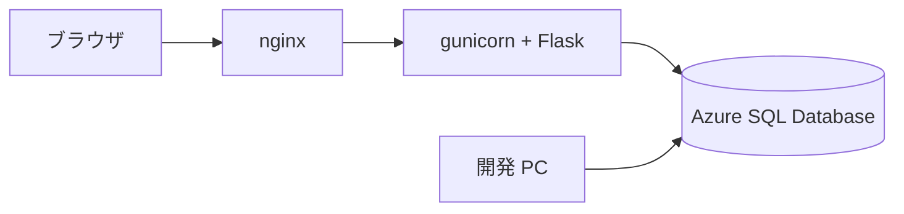

# Flask + Azure SQL Database で作る Todo アプリ

Udemy コース「作りながら覚える Microsoft Azure 入門講座（IaaS 編）」の教材です。Flask で書いた Todo アプリを、開発 PC（macOS）と Azure VM（Ubuntu 24.04 LTS）の両方で動かします。

タスクの一覧・追加・完了状態の変更・削除ができます。ログイン認証はありません。

## 全体構成

ブラウザから Azure SQL Database までの経路です。



開発 PC と Azure VM は、同じ Azure SQL Database に接続します。データベースは 1 つだけ作ります。

VM では nginx がブラウザからの要求を受け、gunicorn へ転送します。**gunicorn は Flask アプリを常駐させる WSGI サーバーです。** Flask に付属する開発用サーバーは本番向けではないため、VM では使いません。

接続情報を書く `src/.env` は `.gitignore` の対象です。リポジトリにコミットしないでください。

## 関連文書

| 文書                               | 内容                                           |
| ---------------------------------- | ---------------------------------------------- |
| [要件定義書](docs/requirements.md) | 背景・機能要件・スコープ                       |
| [設計書](docs/design.md)           | ファイル構成・ルーティング・テーブル・通信仕様 |

**本書は手順書です。** ポート番号やタイムアウトの値、設計の理由は設計書を参照してください。

## ローカル実行手順

開発 PC（macOS）でアプリを動かすまでの手順です。上から順に実行してください。

### 前提条件

| 項目                     | 内容                                 |
| ------------------------ | ------------------------------------ |
| OS                       | macOS                                |
| Homebrew                 | 導入済みであること                   |
| Azure サブスクリプション | Azure ポータルにサインインできること |

### 1. uv の導入

uv は Python のパッケージ管理ツールです。バージョンを固定して導入します。Azure VM 側でも同じバージョンを使うため、環境の差が出ません。

```bash
curl -LsSf https://astral.sh/uv/0.9.18/install.sh | sh
```

導入できたことを確認します。

```bash
uv --version
```

**`pip` は使いません。** 依存パッケージの導入もアプリの起動も、すべて uv 経由で行います。

### 2. ODBC Driver 18 の導入

Python から SQL Server へ接続するためのドライバです。あわせて `sqlcmd`（`mssql-tools18`）も導入します。テーブルの作成に使います。

```bash
brew tap microsoft/mssql-release https://github.com/Microsoft/homebrew-mssql-release
brew install msodbcsql18 mssql-tools18
```

導入できたことを確認します。

```bash
odbcinst -q -d
```

次のように表示されれば成功です。

```text
[ODBC Driver 18 for SQL Server]
```

### 3. 依存パッケージのインストール

リポジトリのルートで実行します。`uv.lock` に固定されたバージョンがそのまま入ります。

```bash
uv sync
```

Python 3.12 が使われていることを確認します。

```bash
uv run python -V
```

### 4. Azure SQL Database の作成

Azure ポータルで作成します。**無料オファーの設定を 1 か所だけ間違えると課金されます。** 下の項目 4 を必ず確認してください。

1. 「SQL データベース」から新規作成を開始します
2. リソースグループとデータベース名（例: `todo`）を指定します
3. サーバーを新規作成します。認証方法は **SQL 認証** を選び、サーバー管理者ログインのユーザー名とパスワードを控えます
4. コンピューティングとストレージで **サーバーレス** を選び、**無料オファーを適用します**。「制限に達したとき」の動作は **「データベースを自動一時停止する」** を選びます

   > 「課金して継続」を選ぶと、無料枠を超えた分が課金されます。しかも**同一の請求期間内は無料枠に戻せません。**

5. 自動一時停止の遅延は既定の **60 分** のままにします
6. ネットワークの設定でパブリックエンドポイントを有効にし、「**現在のクライアント IP アドレスを追加する**」を「はい」にします
7. 作成を完了します

このサーバー管理者ログインを、アプリの接続にもそのまま使います。アプリ専用のユーザーは作りません。

### 5. テーブルの作成

`src/schema.sql` を実行して `dbo.todos` テーブルを作ります。**アプリはテーブルを自動作成しません。** 複数の VM や複数のワーカーが同時に起動したときに競合するためです。

リポジトリのルートで実行します。

```bash
sqlcmd -S <サーバー名>.database.windows.net -d todo -U <管理者ユーザー> -i src/schema.sql
```

パスワードは非表示のプロンプトで尋ねられます。`-P` オプションは使いません。**パスワードがシェルの履歴とプロセス一覧に残るためです。**

テーブルができたことを確認します。

```bash
sqlcmd -S <サーバー名>.database.windows.net -d todo -U <管理者ユーザー> \
    -Q "SELECT COUNT(*) FROM dbo.todos"
```

### 6. 接続情報の設定

テンプレートをコピーして `src/.env` を作ります。**アプリと同じ `src/` に置きます。**

```bash
cp src/.env.sample src/.env
```

`src/.env` を開き、手順 4 で控えた値を記入します。

```text
DB_HOST=<サーバー名>.database.windows.net
DB_NAME=todo
DB_USER=<管理者ユーザー>
DB_PASSWORD=<パスワード>
```

パスワードに `@` や `:` が含まれていても、そのまま記入して問題ありません。アプリ側で正しくエスケープします。

### 7. アプリの起動

```bash
uv run python src/app.py
```

ブラウザで <http://127.0.0.1:5000> を開きます。タスクを追加して、一覧に表示されれば成功です。

停止するときは、起動したターミナルで `Ctrl + C` を押します。

**`Address already in use` で起動できない場合は、AirPlay レシーバーが 5000 番を使っています。** 対処はトラブルシュートの「ローカルで `Address already in use` になる」を参照してください。

`src/.env` を書き換えても反映されません。**接続情報はアプリの起動時に読み込みます。** 修正したら `Ctrl + C` で停止して、起動し直してください。

#### gunicorn で起動する場合

VM と同じ経路を確認したいときに使います。ローカル開発では必要ありません。

```bash
uv run gunicorn --chdir src --bind 127.0.0.1:8000 --workers 3 --timeout 150 --access-logfile - app:app
```

ブラウザで <http://127.0.0.1:8000> を開きます。リクエストごとにアクセスログが表示されます。

## Azure デプロイ手順

Azure VM（Ubuntu 24.04 LTS）にアプリを配置して公開します。**ローカル実行手順の手順 4 から 6 まで（Azure SQL Database の作成、テーブルの作成、接続情報の確認）を先に終わらせてください。**

### 構成

| 項目             | 値                                              |
| ---------------- | ----------------------------------------------- |
| OS イメージ      | Ubuntu Server 24.04 LTS                         |
| VM サイズ        | `Standard_F1as_v7`                              |
| 管理者ユーザー名 | `azureuser`                                     |
| 認証の種類       | SSH 公開キー                                    |
| NSG（受信規則）  | 22/tcp と 80/tcp を自分のグローバル IP のみ許可 |

### 1. Azure VM の作成

Azure ポータルで仮想マシンを作成します。

1. イメージに **Ubuntu Server 24.04 LTS** を選びます
2. サイズは `Standard_F1as_v7` を選びます
3. 管理者アカウントの認証の種類は **SSH 公開キー**、ユーザー名は `azureuser` にします
4. キーペアを新規作成し、秘密鍵ファイル（`ssh-key.pem`）をダウンロードします。**再ダウンロードはできません**
5. 受信ポートは **HTTP (80)** と **SSH (22)** を許可します
6. 作成後、NSG の受信規則を編集し、22/tcp と 80/tcp の**ソースを自分のグローバル IP アドレスだけ**に絞ります

自分のグローバル IP アドレスは、開発 PC で次のコマンドを実行すると分かります。

```bash
curl -s https://ifconfig.me
```

このアプリにはログイン認証がありません。**NSG のソース IP 制限が唯一のアクセス制御です。** `Any` のまま公開しないでください。

### 2. 秘密鍵の権限設定

ダウンロードした秘密鍵を `~/.ssh/` へ移動し、**所有者だけが読める権限にします。**

```bash
mv ~/Downloads/ssh-key.pem ~/.ssh/ssh-key.pem
chmod 400 ~/.ssh/ssh-key.pem
```

**この手順を飛ばすと SSH が鍵を受け付けません。** ダウンロード直後のファイルは他のユーザーからも読める権限になっており、SSH は「保護されていない鍵」とみなして接続を拒否します。

### 3. SSH 接続の確認

```bash
ssh -i ~/.ssh/ssh-key.pem azureuser@<VM のパブリック IP>
```

`<VM のパブリック IP>` は、Azure ポータルの仮想マシンの概要ページで確認できます。初回は接続先の確認を求められるので `yes` と入力します。

### 4. VM の送信元 IP アドレスの確認

**SSH で VM に接続した状態で**実行します。VM が Azure SQL Database へ接続するときの送信元 IP アドレスを調べます。

```bash
curl -s https://ifconfig.me
```

表示された IP アドレスを控えます。**VM のパブリック IP とは異なる場合があります。**

### 5. Azure SQL Database のファイアウォール規則の追加

Azure ポータルで SQL サーバーの「ネットワーク」を開き、ファイアウォール規則に**手順 4 で控えた IP アドレス**を追加して保存します。

**この手順を飛ばすと、接続情報が正しくてもデータベースに到達できません。** アプリの画面には「データベースに接続できません」とだけ表示され、原因が分かりません。

### 6. ファイルの転送

**開発 PC のターミナル**（SSH を抜けた状態）で、リポジトリのルートから実行します。

```bash
COPYFILE_DISABLE=1 tar czf - \
    --no-xattrs --exclude='src/.env' --exclude='__pycache__' \
    src pyproject.toml uv.lock .python-version deploy \
    | ssh -i ~/.ssh/ssh-key.pem azureuser@<VM のパブリック IP> \
        "mkdir -p ~/todo-src && tar xzf - -C ~/todo-src"
```

転送するのは次のファイルとディレクトリだけです。

| 対象              | 用途                                   |
| ----------------- | -------------------------------------- |
| `src/`            | アプリ本体・テンプレート・テーブル定義 |
| `pyproject.toml`  | 依存パッケージの定義                   |
| `uv.lock`         | バージョン固定                         |
| `.python-version` | Python のバージョン                    |
| `deploy/`         | セットアップスクリプトと設定一式       |

**`--exclude='src/.env'` を必ず付けてください。** 接続情報は VM 上で記入します。開発 PC の `src/.env` を送ると、VM に記入済みの内容があっても上書きされる可能性があります。

#### COPYFILE_DISABLE=1 と --no-xattrs が必要な理由

macOS の `tar` は、**macOS 固有の情報を 2 通りの方法で書庫へ混ぜます。** どちらも Linux 側では不要です。

| 指定                 | 防ぐもの                  | 付けないと起きること                                                     |
| -------------------- | ------------------------- | ------------------------------------------------------------------------ |
| `COPYFILE_DISABLE=1` | AppleDouble ファイル      | VM 側に `._app.py` のような不要なファイルが並びます                      |
| `--no-xattrs`        | 拡張属性（`com.apple.*`） | 展開時に `Ignoring unknown extended header keyword` の警告が大量に出ます |

どちらも動作は止まりませんが、**警告が 10 行以上流れると、セットアップが失敗したように見えます。**

### 7. セットアップスクリプトの実行

再び SSH で VM へ接続し、実行します。

```bash
ssh -i ~/.ssh/ssh-key.pem azureuser@<VM のパブリック IP>
sudo ~/todo-src/deploy/setup.sh
```

スクリプトは次の作業をまとめて行います。完了まで数分かかります。

1. ODBC Driver 18 と `mssql-tools18` の導入
2. nginx の導入
3. uv の導入（`/usr/local/bin/uv`）
4. 実行ユーザー `todo` の作成とアプリの `/opt/todo` への配置
5. 依存パッケージのインストール
6. systemd サービスの登録と起動
7. nginx の設定と起動

**接続情報を記入する前でも、スクリプトは正常に完了します。** 起動確認には `/healthz` を使っており、この URL はデータベースに接続しません。

最後に「セットアップが完了しました」と表示され、次に行う手順の一覧が出ます。**そのうち送信元 IP の確認とファイアウォール規則の追加は、手順 4 と手順 5 で済ませています。**

### 8. 接続情報の記入

`/opt/todo/src/.env` に、ローカル実行手順の手順 6 と同じ内容を記入します。

```bash
sudo -u todo nano /opt/todo/src/.env
```

保存は `Ctrl + O` → `Enter`、終了は `Ctrl + X` です。

`src/.env` の所有者は `todo`、パーミッションは 600 です。接続情報を含むため、アプリの実行ユーザーだけが読める状態にしています。**`sudo -u todo` を付けて `todo` ユーザーとして編集してください。** 所有者とパーミッションを保ったまま書き換えられます。

### 9. サービスの再起動

`src/.env` は起動時に読み込まれるため、記入したら再起動します。

```bash
sudo systemctl restart todo
```

起動したことを確認します。

```bash
systemctl status todo
```

`Active: active (running)` と表示されれば成功です。

### 10. ブラウザからの確認

```text
http://<VM のパブリック IP>
```

タスクの追加、完了状態の変更、削除がすべて動作すれば完了です。

**初回の表示に 1 分ほどかかる場合があります。** 異常ではありません。理由はトラブルシュートの「初回アクセスが遅い」を参照してください。

### VM 再起動後の動作

systemd に登録済みのため、VM を再起動してもアプリは自動的に復帰します。手動での起動操作は不要です。

## トラブルシュート

### まず実行するコマンド

**アプリの画面にはエラーの詳細を表示しません。** ODBC のエラーメッセージにはサーバー名やユーザー名が含まれるためです。原因はサーバーのログでしか分かりません。

VM 上で次のコマンドを実行してください。

| 目的                 | コマンド                             | 期待する結果                     |
| -------------------- | ------------------------------------ | -------------------------------- |
| ログの確認           | `sudo journalctl -u todo -f`         | 例外のトレースバックが確認できる |
| サービスの状態確認   | `systemctl status todo`              | `Active: active (running)`       |
| アプリの死活確認     | `curl http://127.0.0.1:8000/healthz` | `ok`                             |
| 待ち受けアドレス確認 | `sudo ss -ltnp \| grep 8000`         | `127.0.0.1:8000` になっている    |
| nginx の状態確認     | `systemctl status nginx`             | `Active: active (running)`       |

`journalctl -f` は新しいログを表示し続けます。**ログを見ながらブラウザを操作すると、どの操作で何が起きたかが分かります。** アクセスログも同じ場所に出ます。終了は `Ctrl + C` です。

**`/healthz` はデータベースに接続しません。** ここが `ok` を返すのに画面がエラーになる場合、原因はアプリではなくデータベースへの接続です。切り分けに使ってください。

待ち受けが `0.0.0.0:8000` になっている場合、`todo.service` の `--bind` が効いていません。認証のないアプリが nginx を経由せずに公開されている状態です。

### 初回アクセスが遅い

**原因** — Azure SQL Database のサーバーレス構成は、無操作が続くと自動的に一時停止します。**停止中のデータベースへの接続は、エラーをすぐに返さずに待たされます。** 接続を試みたこと自体が再開の引き金になり、再開の完了までおよそ 40 秒かかります。

**影響** — アプリが接続をやり直すため、表示まで**待たされます。実機では 50 秒前後で表示されました。** その間、ブラウザは読み込み中のままになります。

**対処** — 待ってください。異常ではありません。2 分以上待っても復帰しない場合は、次項の「データベースに接続できません」を確認してください。

自動一時停止は意図した設計です。**アプリと nginx のタイムアウトは、この待ち時間に合わせて設定しています。** 値と理由は[設計書の「タイムアウト」](docs/design.md#タイムアウト)を参照してください。

### 「データベースに接続できません」と表示される

画面に次のメッセージが出た場合です。

```text
データベースに接続できません。src/.env の接続情報と、Azure SQL Database の
ファイアウォール規則にクライアント IP が登録されているかを確認してください。
```

原因は 4 つ考えられます。上から順に確認してください。

| 順  | 原因                             | 確認方法                                         | 対処                                            |
| --- | -------------------------------- | ------------------------------------------------ | ----------------------------------------------- |
| 1   | ファイアウォール規則に IP がない | 接続元で `curl -s https://ifconfig.me`           | 表示された IP を SQL サーバーの規則へ追加します |
| 2   | `src/.env` の記入誤り            | `sudo journalctl -u todo -n 50 --no-pager`       | サーバー名・ユーザー名・パスワードを修正します  |
| 3   | データベースが停止中             | 1 分ほど待って再読み込みする                     | 前項を参照します                                |
| 4   | 無料 vCore 秒の枯渇              | Azure ポータルでデータベースの使用量を確認します | **翌月まで復旧しません**                        |

**原因 3 と原因 4 は、画面上は区別できません。** 無操作による停止は接続を試みれば再開しますが、枯渇による停止は**その月の残りは再開しません。** 何度やり直しても復旧しない場合は、使用量を確認してください。

**原因はログのエラー番号で切り分けます。** 画面のメッセージは 4 つとも同じです。

| ログに出るエラー | 意味                             | 待つと直るか   |
| ---------------- | -------------------------------- | -------------- |
| `40615`          | ファイアウォール規則に IP がない | 直りません     |
| `18456`          | ユーザー名かパスワードの誤り     | 直りません     |
| `40613`          | データベースが利用できない       | 直ります       |
| `HYT00`          | ログインのタイムアウト           | **場合による** |

**`HYT00` は 2 つの原因で出ます。** データベースが再開中の場合と、**サーバー名の誤りやネットワークの不達**の場合です。アプリからは区別できないため、どちらも再試行して待ちます。

`HYT00` が出て待っても直らないときは、**まず `DB_HOST` の綴りを確認してください。** 存在しないサーバー名でも、エラーは即座には返らず 15 秒待ってから `HYT00` になります。

接続情報を直したあとは、サービスを再起動してください。**接続情報はアプリの起動時に読み込みます。**

```bash
sudo -u todo nano /opt/todo/src/.env
sudo systemctl restart todo
```

### 「テーブル dbo.todos がありません」と表示される

**原因** — `src/schema.sql` を実行していません。**アプリはテーブルを自動作成しません。**

**影響** — 一覧も追加も操作できません。

**対処** — 開発 PC からテーブルを作成します。ローカル実行手順の手順 5 を実行してください。作成したら画面を再読み込みします。**アプリの再起動は不要です。**

VM 上で作成することもできます。`sqlcmd` は PATH に入らないため、絶対パスで実行します。

```bash
/opt/mssql-tools18/bin/sqlcmd -S <サーバー名>.database.windows.net \
    -d todo -U <管理者ユーザー> -i /opt/todo/src/schema.sql
```

`DB_NAME` に別のデータベースを指定している場合も同じ表示になります。`src/.env` を確認してください。

### ローカルで `Address already in use` になる

**原因** — **macOS の AirPlay レシーバーが 5000 番を使っています。** 既定で有効になっているため、多くの Mac で発生します。

**影響** — アプリが起動できません。

**対処** — まず、何が 5000 番を使っているか確認します。

```bash
lsof -nP -iTCP:5000 -sTCP:LISTEN
```

`ControlCenter` と表示されたら AirPlay レシーバーです。**システム設定の「一般」→「AirDrop と Handoff」で「AirPlay レシーバー」をオフにしてください。** 確認したら、もう一度アプリを起動します。

AirPlay を使い続けたい場合は、ポートを変えて起動することもできます。

```bash
uv run flask --app src/app run --port 5001
```

この場合、ブラウザで開く URL も <http://127.0.0.1:5001> になります。

### ブラウザに 502 Bad Gateway が表示される

**原因** — nginx は動いていますが、転送先の gunicorn が応答していません。

**影響** — 画面が表示されません。

**対処** — サービスの状態とログを確認します。

```bash
systemctl status todo
sudo journalctl -u todo -n 50 --no-pager
```

**`src/.env` の記入誤りでは 502 になりません。** 接続に失敗しても画面にメッセージが出るだけで、プロセスは動き続けます。502 は、gunicorn のプロセスそのものが起動していないことを示します。ログで起動時のエラーを確認してください。

`Active: activating (auto-restart)` が繰り返される場合、`src/app.py` の読み込みに失敗しています。5 回連続で失敗すると `failed` になり、状態から判別できます。

### ブラウザに 504 Gateway Time-out が表示される

**原因** — nginx が待っている間に、gunicorn からの応答が返りませんでした。

**影響** — 画面が表示されません。

**対処** — データベースの復帰待ちが nginx の上限を超えた可能性があります。`journalctl` でアプリのログを確認し、`HYT00` や `40613` が続いているなら無料 vCore 秒の残量を確認してください。

`todo.nginx.conf` の `proxy_read_timeout` を短くしていないかも確認してください。**nginx の既定値のままでは復帰を待てません。** 設定すべき値は[設計書の「タイムアウト」](docs/design.md#タイムアウト)にあります。

### SSH で「REMOTE HOST IDENTIFICATION HAS CHANGED」と警告される

**原因** — 以前に使った VM と同じパブリック IP アドレスが、新しい VM に割り当てられました。VM を作り直すと起こります。

**影響** — 次の警告が出て接続できません。

```text
WARNING: REMOTE HOST IDENTIFICATION HAS CHANGED!
IT IS POSSIBLE THAT SOMEONE IS DOING SOMETHING NASTY!
```

**対処** — その IP アドレスの古い記録だけを消します。

```bash
ssh-keygen -R <VM のパブリック IP>
```

**VM を作り直した覚えがない場合は、消さずに調べてください。** この警告は本来、接続先が別のサーバーにすり替わったことを知らせるものです。

### VM に `._` で始まるファイルが並ぶ / 展開時に警告が出る

**原因** — macOS の `tar` で転送するときに `COPYFILE_DISABLE=1` または `--no-xattrs` を付けませんでした。

**影響** — 前者では `._app.py` のような AppleDouble ファイルが VM 側に残ります。後者では展開時に次の警告が並びます。どちらも動作には影響しません。

```text
tar: Ignoring unknown extended header keyword 'LIBARCHIVE.xattr.com.apple.provenance'
```

**対処** — VM 上で不要なファイルを削除し、両方を付けて転送し直します。

```bash
find ~/todo-src -name '._*' -delete
```

### 接続が途中で切れる

**アイドル状態の接続が切断されても、アプリは影響を受けません。** 対処は不要です。理由は[設計書の「接続プールを使わない」](docs/design.md#接続プールを使わない)を参照してください。

## 参考リンク

- [Azure SQL Database の無料オファーに関する FAQ](https://learn.microsoft.com/ja-jp/azure/azure-sql/database/free-offer-faq)
- [Linux への Microsoft ODBC ドライバーのインストール](https://learn.microsoft.com/ja-jp/sql/connect/odbc/linux-mac/installing-the-microsoft-odbc-driver-for-sql-server)
- [Flask ドキュメント](https://flask.palletsprojects.com/)
- [gunicorn ドキュメント](https://docs.gunicorn.org/)
- [移植元リポジトリ（Flask + MySQL 版）](https://github.com/m-oka-system/python-flask-mysql-todo)
