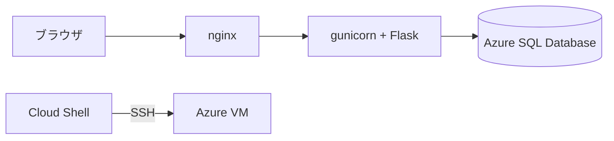

# Flask + Azure SQL Database で作る Todo アプリ

Udemy コース「作りながら覚える Microsoft Azure 入門講座（IaaS 編）」の教材です。Azure VM（Ubuntu 24.04 LTS）に Todo アプリを構築します。

タスクの一覧・追加・完了状態の変更・削除ができます。ログイン認証はありません。

## 全体構成

ブラウザから Azure SQL Database までの経路です。



VM では nginx がブラウザからの要求を受け、gunicorn へ転送します。**gunicorn は Flask アプリを常駐させる WSGI サーバーです。** Flask に付属する開発用サーバーは本番向けではないため、VM では使いません。

## 関連文書

| 文書                                        | 内容                                           |
| ------------------------------------------- | ---------------------------------------------- |
| [要件定義書](docs/requirements.md)          | 背景・機能要件・スコープ                       |
| [設計書](docs/design.md)                    | ファイル構成・ルーティング・テーブル・通信仕様 |
| [トラブルシュート](docs/troubleshooting.md) | 症状別の原因と対処                             |

**本書は手順書です。** ポート番号やタイムアウトの値、設計の理由は設計書を参照してください。

## 前提条件

**作業はすべて Azure Cloud Shell（Bash）で行います。** 開発 PC に何かを導入する必要はありません。

| 項目                     | 内容                                     |
| ------------------------ | ---------------------------------------- |
| ブラウザ                 | Azure ポータルにサインインできること     |
| Azure サブスクリプション | リソースを作成できる権限があること       |
| Cloud Shell              | Bash。ストレージなし（エフェメラル）で可 |

**Cloud Shell は 20 分の無操作でタイムアウトします。** エフェメラルセッションでは、そのときアップロードしたファイルも消えます。作業は続けて進めてください。

## 構成

| 項目             | 値                                            |
| ---------------- | --------------------------------------------- |
| OS イメージ      | Ubuntu Server 24.04 LTS                       |
| VM サイズ        | `Standard_F1as_v7`                            |
| 管理者ユーザー名 | `azureuser`                                   |
| 認証の種類       | SSH 公開キー                                  |
| NSG（受信規則）  | 22/tcp は Cloud Shell、80/tcp はブラウザの IP |

**このアプリにはログイン認証がありません。** NSG のソース IP 制限が唯一のアクセス制御です。`Any` のまま公開しないでください。

## 手順

上から順に実行してください。

### 1. Cloud Shell を開く

Azure ポータル右上の **Cloud Shell** アイコン（`>_`）を選び、**Bash** を選択します。ストレージの確認を求められたら「**ストレージ アカウントは必要ありません**」を選びます。

<https://shell.azure.com> から直接開くこともできます。

**以降のコマンドは、断りがない限り Cloud Shell で実行します。**

### 2. Azure SQL Database の作成

Azure ポータルで作成します。**無料オファーの設定を 1 か所だけ間違えると課金されます。** 下の項目 4 を必ず確認してください。

1. 「SQL データベース」から新規作成を開始します
2. リソースグループとデータベース名（例: `todo`）を指定します
3. サーバーを新規作成します。認証方法は **SQL 認証** を選び、サーバー管理者ログインのユーザー名とパスワードを控えます
4. コンピューティングとストレージで **サーバーレス** を選び、**無料オファーを適用します**。「制限に達したとき」の動作は **「データベースを自動一時停止する」** を選びます

   > 「課金して継続」を選ぶと、無料枠を超えた分が課金されます。しかも**同一の請求期間内は無料枠に戻せません。**

5. 自動一時停止の遅延は既定の **60 分** のままにします
6. ネットワークの設定でパブリックエンドポイントを有効にし、「**現在のクライアント IP アドレスを追加する**」を「はい」にします
7. 作成を完了します

このサーバー管理者ログインを、アプリの接続にもそのまま使います。アプリ専用のユーザーは作りません。

**この手順でテーブルは作りません。** アプリが最初のアクセスのときに `dbo.todos` を作成します。

### 3. Azure VM の作成

Azure ポータルで仮想マシンを作成します。

1. イメージに **Ubuntu Server 24.04 LTS** を選びます
2. サイズは `Standard_F1as_v7` を選びます
3. 管理者アカウントの認証の種類は **SSH 公開キー**、ユーザー名は `azureuser` にします
4. キーペアを新規作成し、秘密鍵ファイル（`ssh-key.pem`）をダウンロードします。**再ダウンロードはできません**
5. 受信ポートは **HTTP (80)** と **SSH (22)** を許可します
6. 作成を完了し、パブリック IP アドレスを控えます

### 4. 受信規則の絞り込み

**VM を作った直後は、22 番と 80 番が全世界へ開いています。** 送信元を自分だけに絞ります。**2 つの IP アドレスを使い分けます。**

Azure ポータルで VM の「ネットワーク設定」を開き、受信規則をそれぞれ編集します。

| ポート | 用途                   | ソースの選び方                                               |
| ------ | ---------------------- | ------------------------------------------------------------ |
| 22     | Cloud Shell からの SSH | **IP Addresses** を選び、下で調べた Cloud Shell の IP を入力 |
| 80     | ブラウザからのアクセス | **My IP address** を選ぶ（自動で入ります）                   |

**80 番は調べる必要がありません。** ポータルは受講者のブラウザからアクセスされているため、`My IP address` を選ぶと Azure 側が送信元を自動で埋めます。

**22 番は手で入力します。** 接続元が Cloud Shell（Azure 側のコンテナ）で、ブラウザとは別のアドレスだからです。Cloud Shell で実行して控えてください。

```bash
curl -s https://api.ipify.org
```

**この 2 つは必ず別のアドレスになります。** 取り違えると、SSH は通るのに画面が出ない（またはその逆）という症状になります。

### 5. 秘密鍵の配置

手順 3 でダウンロードした `ssh-key.pem` を Cloud Shell へアップロードします。

1. Cloud Shell のツールバーから **「ファイルのアップロード/ダウンロード」→「アップロード」** を選びます
2. `ssh-key.pem` を選択します

アップロードした鍵を `~/.ssh/` へ移し、**所有者だけが読める権限にします。**

```bash
mkdir -p ~/.ssh
mv ssh-key.pem ~/.ssh/
chmod 400 ~/.ssh/ssh-key.pem
```

**`chmod 400` を飛ばすと SSH が鍵を受け付けません。** アップロード直後のファイルは他のユーザーからも読める権限になっており、SSH は「保護されていない鍵」とみなして接続を拒否します。

### 6. SSH 接続

```bash
ssh -i ~/.ssh/ssh-key.pem azureuser@<VM のパブリック IP>
```

初回は接続先の確認を求められるので `yes` と入力します。

**接続できない場合は**[トラブルシュートの「SSH で接続できない」](docs/troubleshooting.md#ssh-で接続できない)を参照してください。

### 7. VM の送信元 IP を SQL へ登録

**SSH で VM に接続した状態で**実行します。VM が Azure SQL Database へ接続するときの送信元 IP アドレスを調べます。

```bash
curl -s https://api.ipify.org
```

表示された IP アドレスを、Azure ポータルで SQL サーバーの「ネットワーク」を開き、ファイアウォール規則へ追加して保存します。

**この手順を飛ばすと、接続情報が正しくてもデータベースに到達できません。** アプリの画面には「データベースに接続できません」とだけ表示され、原因が分かりません。

**Cloud Shell の IP でもブラウザの IP でもありません。** VM 自身の送信元アドレスです。

### 8. アプリの取得

**SSH で VM に接続した状態で**実行します。ホームディレクトリに `mssql-todo-app/` ができます。

```bash
sudo apt-get update && sudo apt-get install -y git
git clone --depth 1 --sparse https://github.com/m-oka-system/mssql-todo-app.git
cd mssql-todo-app
git sparse-checkout set src deploy
```

**Ubuntu Server のイメージに git は含まれません。** 1 行目で導入します。

**`Could not get lock` で失敗した場合は、1 分ほど待って同じコマンドを実行してください。** 作成直後の VM では自動更新が動いていることがあります。

**VM に置くのは、アプリの実行に必要なファイルだけです。** `docs/` と `infra/` は展開されません。範囲と理由は[設計書の「VM へ取得する範囲」](docs/design.md#vm-へ取得する範囲)を参照してください。

**`src/.env` はリポジトリに含まれません。** `.gitignore` の対象のため、接続情報は VM 上で記入します（手順 10）。

### 9. セットアップスクリプトの実行

手順 8 に続けて、VM 上で実行します。

```bash
sudo deploy/setup.sh
```

スクリプトは次の作業をまとめて行います。完了まで数分かかります。

1. ODBC Driver 18 の導入
2. nginx の導入
3. エディタ（`micro`）の導入
4. uv の導入（`/usr/local/bin/uv`）
5. 実行ユーザー `todo` の作成とアプリの `/opt/todo` への配置
6. 依存パッケージのインストール
7. systemd サービスの登録と起動
8. nginx の設定と起動

**接続情報を記入する前でも、スクリプトは正常に完了します。** 起動確認には `/healthz` を使っており、この URL はデータベースに接続しません。

最後に「セットアップが完了しました」と表示され、次に行う手順の一覧が出ます。**そのうち送信元 IP の確認とファイアウォール規則の追加は、手順 7 で済ませています。**

### 10. 接続情報の記入

`/opt/todo/src/.env` に、手順 2 で控えた値を記入します。

```bash
sudo -u todo micro /opt/todo/src/.env
```

記入する内容です。

```text
DB_HOST=<サーバー名>.database.windows.net
DB_NAME=todo
DB_USER=<管理者ユーザー>
DB_PASSWORD=<パスワード>
```

パスワードに `@` や `:` が含まれていても、そのまま記入して問題ありません。アプリ側で正しくエスケープします。

**`micro` は `deploy/setup.sh` が導入するエディタです。** 矢印キーで移動して、そのまま書き換えられます。

| 操作     | macOS           | Windows                    |
| -------- | --------------- | -------------------------- |
| 保存     | `Ctrl` + `S`    | `Ctrl` + `S`               |
| 終了     | `Ctrl` + `Q`    | `Ctrl` + `Q`               |
| 元に戻す | `Ctrl` + `Z`    | `Ctrl` + `Z`               |
| 貼り付け | **`Cmd` + `V`** | **`Ctrl` + `Shift` + `V`** |

**保存・終了・元に戻すは、macOS でも `Cmd` ではなく `Ctrl` です。** micro が受け取るキーで、OS による違いはありません。

**貼り付けだけはブラウザ側の機能を使います。** micro の `Ctrl` + `V` が読むのは VM 側のクリップボードで、手元でコピーした内容は入りません。

**保存せずに閉じたい場合は、`Ctrl` + `Q` を押してから `n` を押します。** 何度でもやり直せます。

`.env` の所有者は `todo`、パーミッションは 600 です。接続情報を含むため、アプリの実行ユーザーだけが読める状態にしています。**`sudo -u todo` を付けて `todo` ユーザーとして編集してください。** 所有者とパーミッションを保ったまま書き換えられます。

### 11. サービスの再起動

`.env` は起動時に読み込まれるため、記入したら再起動します。

```bash
sudo systemctl restart todo
```

起動したことを確認します。

```bash
systemctl status todo
```

`Active: active (running)` と表示されれば成功です。

### 12. ブラウザからの確認

```text
http://<VM のパブリック IP>
```

タスクの追加、完了状態の変更、削除がすべて動作すれば完了です。

**初回の表示に 1 分ほどかかる場合があります。** 異常ではありません。理由は[トラブルシュートの「初回アクセスが遅い」](docs/troubleshooting.md#初回アクセスが遅い)を参照してください。

**画面が表示されない場合は**[トラブルシュートの「ブラウザから VM にアクセスできない」](docs/troubleshooting.md#ブラウザから-vm-にアクセスできない)を確認してください。80 番の許可 IP がブラウザの送信元と合っていない可能性があります。

## アプリを更新したとき

リポジトリが更新されたときは、VM 上で 1 行実行します。

```bash
cd ~/mssql-todo-app && git pull && sudo deploy/setup.sh
```

`deploy/setup.sh` は何度実行しても同じ結果になります。依存パッケージの更新とサービスの再起動まで実行するため、`systemctl restart` を別に打つ必要はありません。

**記入済みの `/opt/todo/src/.env` は上書きしません。** 接続情報を書き直す必要はありません。

## VM 再起動後の動作

systemd に登録済みのため、VM を再起動してもアプリは自動的に復帰します。手動での起動操作は不要です。

## うまくいかないとき

**症状別の対処は[トラブルシュート](docs/troubleshooting.md)にまとめています。**

| 症状                             | 参照先                                                                                                                                               |
| -------------------------------- | ---------------------------------------------------------------------------------------------------------------------------------------------------- |
| 画面が出るまで遅い               | [初回アクセスが遅い](docs/troubleshooting.md#初回アクセスが遅い)                                                                                     |
| 「データベースに接続できません」 | [同項](docs/troubleshooting.md#データベースに接続できませんと表示される)                                                                             |
| SSH で接続できない               | [SSH で接続できない](docs/troubleshooting.md#ssh-で接続できない)                                                                                     |
| 502 / 504 が出る                 | [502](docs/troubleshooting.md#ブラウザに-502-bad-gateway-が表示される) / [504](docs/troubleshooting.md#ブラウザに-504-gateway-time-out-が表示される) |

## 参考リンク

- [Azure SQL Database の無料オファーに関する FAQ](https://learn.microsoft.com/ja-jp/azure/azure-sql/database/free-offer-faq)
- [Azure Cloud Shell のエフェメラル セッション](https://learn.microsoft.com/ja-jp/azure/cloud-shell/get-started/ephemeral)
- [Linux への Microsoft ODBC ドライバーのインストール](https://learn.microsoft.com/ja-jp/sql/connect/odbc/linux-mac/installing-the-microsoft-odbc-driver-for-sql-server)
- [Flask ドキュメント](https://flask.palletsprojects.com/)
- [gunicorn ドキュメント](https://docs.gunicorn.org/)
- [移植元リポジトリ（Flask + MySQL 版）](https://github.com/m-oka-system/python-flask-mysql-todo)
