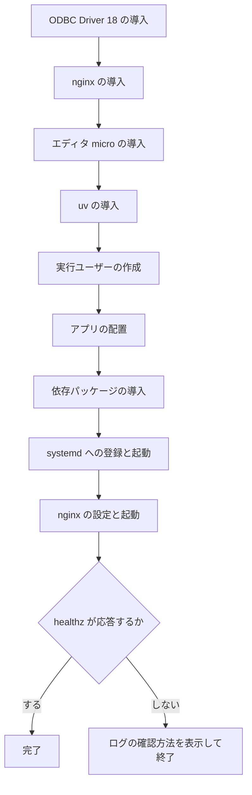

# VM へのアプリの配置

**既にある VM の中へアプリを配置して起動します。** Azure のリソースは作りません。リソースの作成は[コース内ラボ](../labs/README.md)か、[構築手順](../docs/build-todo-app.md)のポータル操作で行います。

## ファイルの一覧

| ファイル               | 実行される場面                                            |
| ---------------------- | --------------------------------------------------------- |
| `setup.sh`             | 単一の VM へ SSH 接続し、受講者または拡張機能が実行します |
| `vmss-portal-setup.sh` | スケールセットのカスタムスクリプト欄へ貼り付けます        |
| `todo.service`         | gunicorn を systemd で常駐させます                        |
| `todo.nginx.conf`      | nginx から gunicorn へ転送します                          |

**ここに置くのは、人か VM が直接実行できるものだけです。** Terraform の変数展開に依存するテンプレート（`setup.sh.tftpl`）は単独で実行できないため、[`labs/modules/`](../labs/modules/) に置いています。

## セットアップ

VM へ SSH 接続した状態で実行します。手順の全体は[構築手順](../docs/build-todo-app.md)にあります。

```bash
sudo deploy/setup.sh
```

次を順に実行します。完了まで数分かかります。



**接続情報を記入する前でも正常に完了します。** 起動確認に使う `/healthz` はデータベースに接続しません。

## アプリを更新したとき

**手作業で構築した VM の場合です。** リポジトリが更新されたときは、VM 上で 1 行実行します。

```bash
cd ~/mssql-todo-app && git pull && sudo deploy/setup.sh
```

**何度実行しても同じ結果になります。** 依存パッケージの更新とサービスの再起動まで行うため、`systemctl restart` を別に打つ必要はありません。

**記入済みの `/opt/todo/src/.env` は上書きしません。** 接続情報を書き直す必要はありません。

**Terraform で構築した環境では使えません。** VM 上に作業用のリポジトリが残らないためです（取得したものを一時ディレクトリへ置いて削除します）。**リソースグループごと削除して、作り直してください。**

## VM 上の配置

| 項目         | 配置先                                     |
| ------------ | ------------------------------------------ |
| アプリ       | `/opt/todo`                                |
| 接続情報     | `/opt/todo/src/.env`（パーミッション 600） |
| 実行ユーザー | `todo`（ログインシェルなし）               |
| systemd unit | `/etc/systemd/system/todo.service`         |
| nginx 設定   | `/etc/nginx/sites-available/todo.conf`     |

詳しい仕様は[設計書の「デプロイ構成」](../docs/design.md#9-デプロイ構成)を参照してください。

## うまくいかないとき

症状別の対処は[トラブルシュート](../docs/troubleshooting.md)にまとめています。
