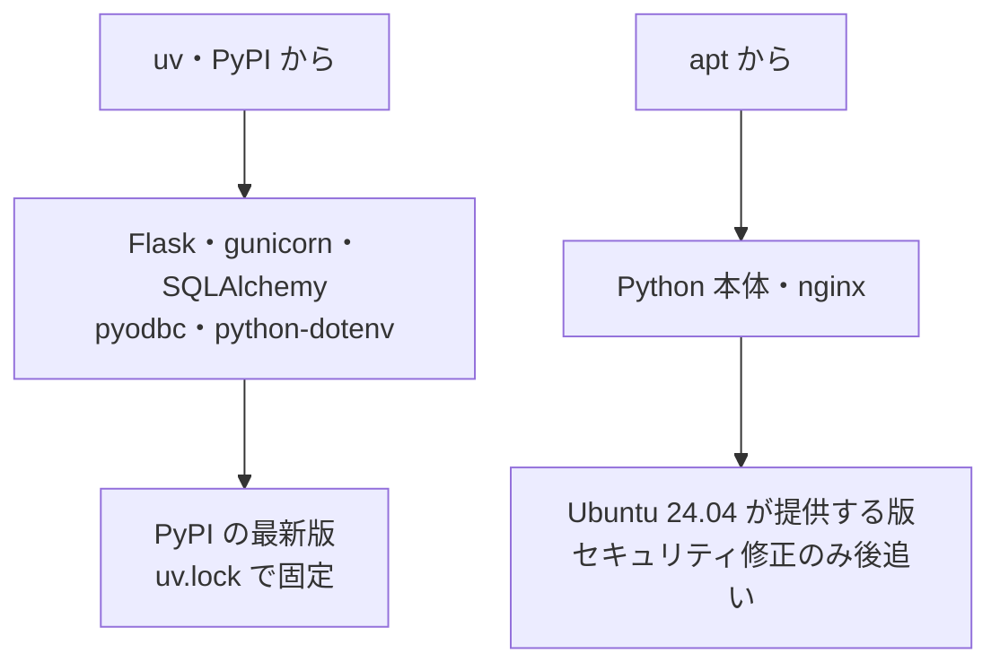
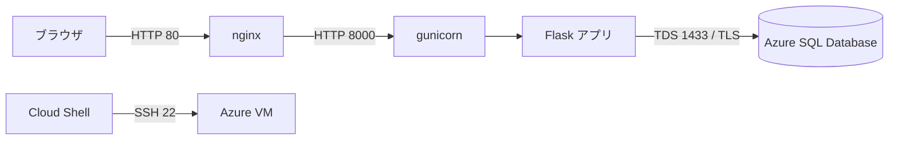
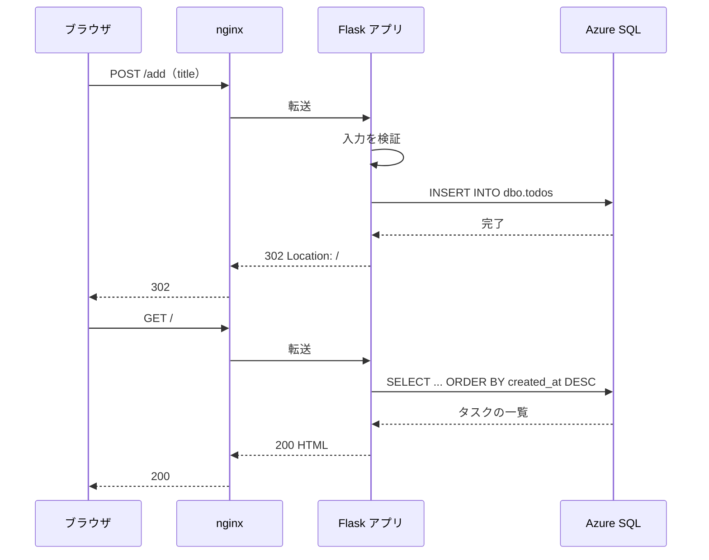
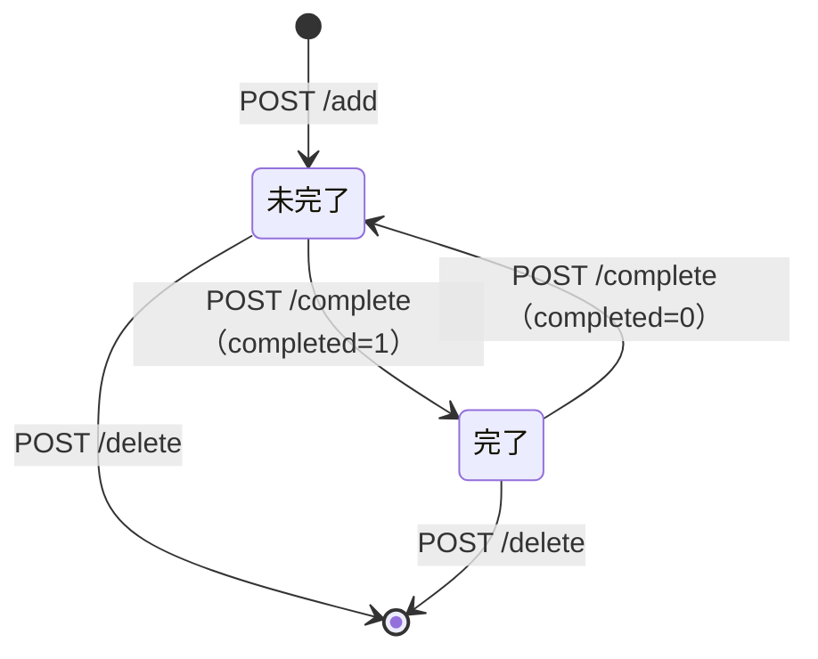
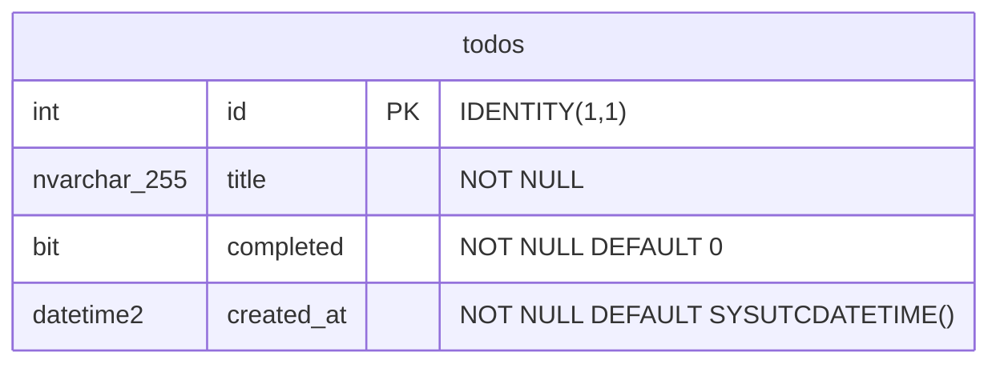
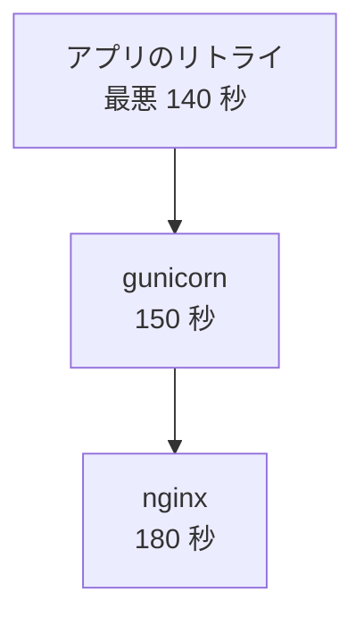
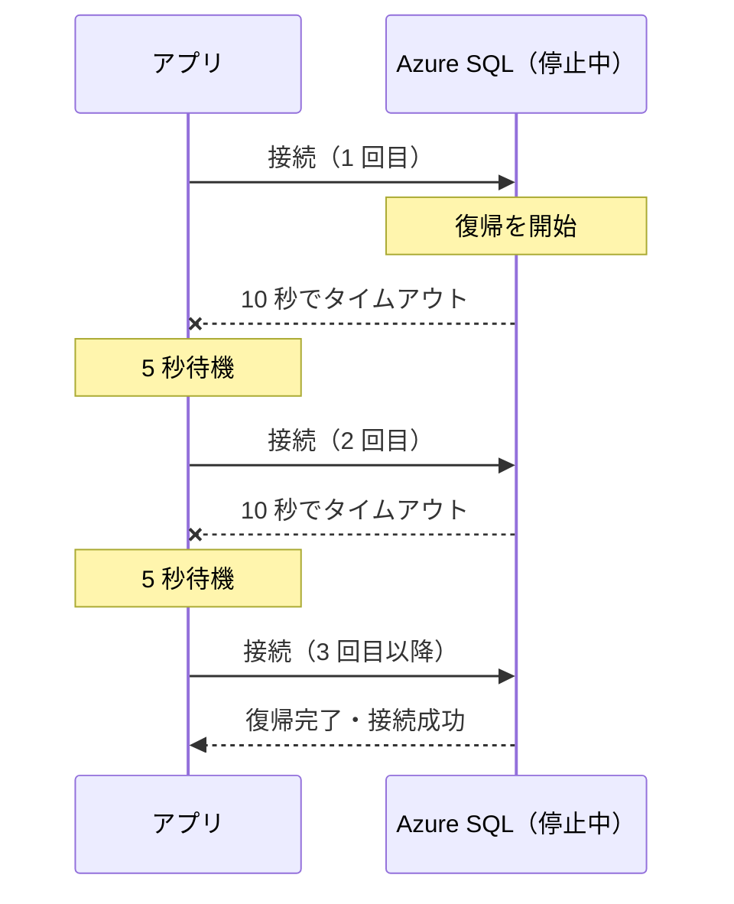
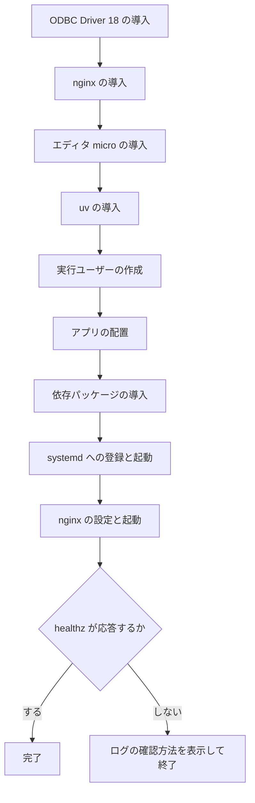

# 設計書

- 作成日: 2026-07-27
- 対象: Todo アプリ（Flask + Azure SQL Database）
- 前提: [要件定義書](requirements.md)

## 1. 技術スタック

| 領域           | 採用                                 | バージョン | 調達元                      |
| -------------- | ------------------------------------ | ---------- | --------------------------- |
| OS（VM）       | Ubuntu 24.04 LTS                     | 24.04      | Azure イメージ              |
| 言語           | Python                               | 3.12       | apt（OS 標準）              |
| フレームワーク | Flask（サーバーサイドレンダリング）  | 3.1.3      | uv（PyPI）                  |
| WSGI サーバー  | gunicorn（VM 上での常駐）            | 26.0.0     | uv（PyPI）                  |
| DB アクセス    | SQLAlchemy Core                      | 2.0.51     | uv（PyPI）                  |
| DB ドライバ    | pyodbc                               | 5.3.0      | uv（PyPI）                  |
| 設定の読み込み | python-dotenv                        | 1.2.2      | uv（PyPI）                  |
| Web サーバー   | nginx（リバースプロキシ）            | 1.24.0     | apt                         |
| ODBC ドライバ  | Microsoft ODBC Driver for SQL Server | 18         | apt（Microsoft リポジトリ） |
| データベース   | Azure SQL Database（サーバーレス）   | —          | Azure                       |
| パッケージ管理 | uv                                   | 0.9.18     | 公式スクリプト              |
| バージョン管理 | git（VM への配布に使用）             | 2.43.0     | apt                         |
| エディタ（VM） | micro（接続情報の記入に使用）        | 2.0.13     | apt（universe）             |

実行時に必要な Python パッケージは 5 つです。

```text
flask / sqlalchemy / pyodbc / python-dotenv / gunicorn
```

### バージョンの決まり方

**調達元によって「最新」の意味が変わります。**



| 調達元     | 対象                   | 最新かどうか                                            |
| ---------- | ---------------------- | ------------------------------------------------------- |
| uv（PyPI） | Python パッケージ 5 つ | **すべて PyPI の最新版です**                            |
| apt        | Python 本体・nginx     | Ubuntu 24.04 が提供する版です。上流の最新ではありません |

**Python パッケージは Ubuntu のサポート範囲に縛られません。** `apt install python3-flask` ではなく uv が PyPI から取得するためです。Ubuntu の役割は Python 3.12 本体を提供することだけです。

### nginx のバージョンについて

| 区分                | バージョン  |
| ------------------- | ----------- |
| Ubuntu 24.04 が提供 | **1.24.0**  |
| nginx 公式の現行    | 1.28 系以降 |

**Ubuntu 24.04 の nginx は 1.24.0 で固定され、セキュリティ修正だけがバックポートされます。** これは LTS の設計どおりの挙動で、脆弱性対応は受けられます。

上流の最新を使うには `nginx.org` のリポジトリを追加する必要がありますが、**受講者の手順が 1 つ増え、Ubuntu の標準から外れます。** 教材としては `apt install nginx` のままとします。

### バージョンを固定する理由

`uv.lock` で Python パッケージのバージョンを固定し、uv 自体もインストール時にバージョンを指定します。

**教材は数年にわたって使うためです。** 固定しないと、受講者が実行した日によって環境が変わり、収録済みの手順と実際の画面が食い違います。

## 2. システム構成

ブラウザからデータベースまでの経路です。



**受講者は VM からのみ接続します。** データベースは 1 つだけ作ります。作成者が手元でアプリを動かす場合は、同じデータベースへ直接接続します。

### 役割分担

| 構成要素  | 役割                                                     |
| --------- | -------------------------------------------------------- |
| nginx     | 80 番で受け、ループバックの gunicorn へ転送します        |
| gunicorn  | Flask アプリを常駐させます。ワーカー 3 つで処理します    |
| Flask     | 要求を受けて画面を組み立てます                           |
| Azure SQL | データを保持します。無操作が続くと自動的に一時停止します |

### ファイル構成

**アプリの動作に関わる範囲を中心に示します。** 補足資料（`reference/`）の中身は[README](../README.md)を参照してください。

```text
mssql-todo-app/
├── README.md               # 教材全体の入口
├── pyproject.toml          # 依存パッケージの定義
├── uv.lock                 # バージョン固定
├── .python-version         # Python のバージョン
├── .gitignore              # git の対象外の指定
├── .gitattributes          # 改行コードの指定
├── docs/
│   ├── build-todo-app.md   # 構築手順
│   ├── requirements.md     # 要件定義書
│   ├── design.md           # 設計書（本書）
│   └── troubleshooting.md  # 症状別の対処
├── labs/                   # コース内ラボ（Terraform で環境を作る側の構成）
│   ├── modules/            # 全ラボで共有するモジュール
│   └── sections/           # 演習ごとの手順書と Terraform
├── scripts/
│   ├── lab-setup.sh        # ラボ共通の起動処理
│   └── check.sh            # コミット前の検証
├── src/
│   ├── app.py              # アプリ本体
│   ├── .env.sample         # 接続情報のテンプレート
│   └── templates/
│       ├── index.html      # 一覧と追加フォーム
│       ├── error.html      # エラーの案内
│       └── debug_info.html # 実行環境の表示（両方の画面から読み込む）
└── deploy/
    ├── README.md              # 配置と更新の手順
    ├── setup.sh               # VM のセットアップ
    ├── vmss-portal-setup.sh   # スケールセット用（ポータルへ貼り付ける）
    ├── todo.service           # systemd unit
    └── todo.nginx.conf        # nginx の設定
```

## 3. 画面設計

画面は 2 つだけです。

| 画面         | テンプレート | 内容                                 |
| ------------ | ------------ | ------------------------------------ |
| 一覧         | `index.html` | 追加フォームとタスクの一覧           |
| エラーの案内 | `error.html` | データベースへ接続できないときの案内 |

一覧の 1 件は、完了ボタン・タスク名・作成日時・削除ボタンで構成します。完了済みのタスク名には取り消し線を引きます。

### 実行環境の表示

**両方の画面に、実行環境の情報を表示します（F-7）。** 部品は `debug_info.html` に置き、2 つの画面から読み込みます。

| 項目            | 取得元                 |
| --------------- | ---------------------- |
| ホスト名        | `socket.gethostname()` |
| プライベート IP | 自身の経路表           |
| DB 名           | 環境変数 `DB_NAME`     |

**同じ情報を `/healthz` が JSON でも返します。** どの VM が応答したかを繰り返し確かめる場面では、HTML から読み取るより `curl` 1 回で済むほうが速いためです。含める項目は画面と同じで、DB 名以外の接続情報は含めません。

```json
{ "db_name": "todo", "hostname": "vmss000000", "private_ip": "10.0.1.5" }
```

**画面の下端へ固定して表示します。** 背景を濃くして、アプリの機能ではないことを見た目で区別します。一覧と重ならないよう、本文の下側に余白を取ります。

**表示を切り替える仕組みは持ちません。** 常に表示します。

**エラーの案内にも表示します。** 接続できないときこそ、どのホストがどのデータベースを見に行ったかが必要になるためです。

**データベースのサーバー名・ユーザー名・パスワードは表示しません（S-11）。** DB 名だけを残します。取り違えても画面は正常に見えるため、気づける手掛かりが必要です。

**プライベート IP は経路表から取得します。** ホスト名からの名前解決（`socket.gethostbyname()`）は使いません。Ubuntu の `/etc/hosts` はホスト名へ `127.0.1.1` を割り当てるため、ループバックが返ります。

## 4. ルーティング仕様

**画面はすべて HTML を返すか、リダイレクトします。** 利用者はブラウザで、フォームの送信とリダイレクトで操作します。JSON を返すのは死活確認の `/healthz` だけです。

| メソッド | パス                      | 用途           | 応答       |
| -------- | ------------------------- | -------------- | ---------- |
| GET      | `/`                       | 一覧の表示     | 200 / HTML |
| POST     | `/add`                    | タスクの追加   | 302 → `/`  |
| POST     | `/complete/<int:todo_id>` | 完了状態の変更 | 302 → `/`  |
| POST     | `/delete/<int:todo_id>`   | タスクの削除   | 302 → `/`  |
| GET      | `/healthz`                | 死活確認       | 200 / JSON |

### 要求パラメータ

| パス                      | 名前        | 形式     | 内容                                               |
| ------------------------- | ----------- | -------- | -------------------------------------------------- |
| `/add`                    | `title`     | フォーム | タスク名（1〜255 文字。絵文字は 2 文字と数えます） |
| `/complete/<int:todo_id>` | `todo_id`   | パス     | 対象のタスク ID                                    |
| `/complete/<int:todo_id>` | `completed` | フォーム | `1`（完了）または `0`（未完了）                    |
| `/delete/<int:todo_id>`   | `todo_id`   | パス     | 対象のタスク ID                                    |

### 応答コード

| コード | 意味                              |
| ------ | --------------------------------- |
| 200    | 正常                              |
| 302    | 更新後に一覧へリダイレクト        |
| 400    | 入力が不正（空文字、255 文字超）  |
| 403    | 他サイトからの書き込みを拒否      |
| 405    | 更新系のパスへ GET でアクセスした |
| 503    | データベースを操作できない        |

### 設計上の約束

**更新はすべて POST で受けます。** GET で状態を変えると、ブラウザの先読みやクローラのアクセスだけでタスクが消えます。更新系のパスへ GET でアクセスすると 405 を返します。

**更新後は一覧へリダイレクトします。** 結果を直接描画すると、ブラウザの再読み込みで同じ更新が再送されます。

**完了状態は反転させず、目的の値を送ります。** 反転はその時点の値に依存するため、二重クリックで意図せず元へ戻ります。

**他サイトからの書き込みは `Sec-Fetch-Site` ヘッダで見分けます。** 認証も Cookie もないため、CSRF トークンを結び付ける対象がありません（要件定義のスコープ外）。このヘッダはブラウザだけが付けられ、スクリプトから偽装できません。値が `cross-site` の POST を 403 で拒否します。ヘッダを送らない古いブラウザや curl は通します。

## 5. 処理の流れ

タスクを追加してから一覧が表示されるまでの流れです。



**追加と再表示で 2 往復します。** これが POST-Redirect-GET です。再読み込みしても追加は繰り返されません。

### タスクの状態



## 6. データベース設計

テーブルは 1 つだけです。



### テーブル定義

**アプリが作成します。** 管理者による事前の作成は不要です。

```sql
IF OBJECT_ID(N'dbo.todos', N'U') IS NULL
CREATE TABLE dbo.todos (
    id         INT IDENTITY(1,1) PRIMARY KEY,
    title      NVARCHAR(255) NOT NULL,
    completed  BIT NOT NULL DEFAULT 0,
    created_at DATETIME2(0) NOT NULL DEFAULT SYSUTCDATETIME()
);
```

| 列           | 型              | 内容                                  |
| ------------ | --------------- | ------------------------------------- |
| `id`         | `INT IDENTITY`  | 自動採番の主キー                      |
| `title`      | `NVARCHAR(255)` | タスク名。日本語を扱うため `NVARCHAR` |
| `completed`  | `BIT`           | 完了なら 1、未完了なら 0              |
| `created_at` | `DATETIME2(0)`  | 作成日時。**UTC** で保存します        |

### 設計上の約束

**テーブルの作成は、最初の一覧表示のときに一度だけ試みます。** 作成できたことをプロセス内に覚え、以降の要求では問い合わせません。gunicorn のワーカーはそれぞれ別のプロセスのため、ワーカーの数だけ試みます。

**存在確認と `CREATE TABLE` は原子的ではありません。** 複数の VM やワーカーが同時に起動すると、両方が「ない」と判断して作成へ進みます。後になった側はエラー 2714（同名のオブジェクトが既にあります）を受け取りますが、**テーブルはできているため成功として扱います。** データが壊れることはありません。

**実機では、この競合は観測できませんでした。** ワーカー 3 つに 8 本の要求を同時に投げても、2714 は 1 度も発生しません。SQL Server が `CREATE TABLE` の実行中にスキーマのロックを取るため、後続の存在確認が待たされ、結果として「既にある」と判断するからです。**2714 の処理は保険として残します。**

**2714 以外のエラーは握りつぶしません。** 権限の不足などを成功として覚えると、以降の要求がすべて「テーブルはある」前提で進み、原因の分からない失敗が続きます。判定には SQLSTATE（`42S01`）とエラー番号（`2714`）の両方を使います。

**既にテーブルがある場合は作り直しません。** 定義を改訂したときは、テーブルを削除してからアプリを再起動する必要があります。手順は[トラブルシュートの「テーブルを作り直したい」](troubleshooting.md#テーブルを作り直したい)にあります。

**テーブルを確認したことをログに残します。** 既にある場合も出ます。目的は、どのデータベースに対して確認したかを記録することです。`DB_NAME` を取り違えても、そちらにテーブルが作られて画面は正常に見えます。

**取り違えの手掛かりは 2 つあります。** 画面に出る DB 名（F-7）と、`journalctl -u todo` のログです。**ログは時系列で残る点が違います。** 接続先を変えた前後の記録が追えます。

**`DATETIME2` はタイムゾーンを持ちません。** 取得した値を UTC と解釈してから日本時間へ変換します。この処理を省くと UTC がそのまま表示されます。

**SQL Server には `CREATE TABLE IF NOT EXISTS` がありません。** `OBJECT_ID` で存在を確認します。

### 実行する SQL

| 用途           | SQL                                                                                        |
| -------------- | ------------------------------------------------------------------------------------------ |
| テーブル作成   | `IF OBJECT_ID(N'dbo.todos', N'U') IS NULL CREATE TABLE dbo.todos (...)`                    |
| 一覧取得       | `SELECT id, title, completed, created_at FROM dbo.todos ORDER BY created_at DESC, id DESC` |
| 追加           | `INSERT INTO dbo.todos (title) VALUES (:title)`                                            |
| 完了状態の変更 | `UPDATE dbo.todos SET completed = :completed WHERE id = :id`                               |
| 削除           | `DELETE FROM dbo.todos WHERE id = :id`                                                     |

**すべて名前付きパラメータ（`:name`）で組み立てます。** 文字列連結は使いません。

一覧の並び順は作成日時の降順です。`created_at` は秒単位のため同時刻になり得ます。`id` を第 2 のキーにして順序を一定にします。

## 7. 通信仕様

### 経路ごとの仕様

| 区間                    | プロトコル | ポート | 暗号化 | 到達範囲                               |
| ----------------------- | ---------- | ------ | ------ | -------------------------------------- |
| ブラウザ → nginx        | HTTP       | 80     | なし   | **インターネット全体**                 |
| Cloud Shell → VM        | SSH        | 22     | あり   | 許可した IP のみ                       |
| nginx → gunicorn        | HTTP       | 8000   | なし   | VM 内のループバック                    |
| アプリ → Azure SQL      | TDS        | 1433   | TLS    | ファイアウォール規則で許可した IP のみ |
| 作成者の PC → Azure SQL | TDS        | 1433   | TLS    | 同上（受講者の経路ではありません）     |

**80 番は送信元を制限しません。** 認証も持たないため、到達した人は誰でもタスクを操作できます。前提と受け入れる範囲は[要件定義の「認証を持たないことの影響」](requirements.md#認証を持たないことの影響)にあります。

**制限しない理由は、受講者のブラウザの送信元 IP が事前に決まらないためです。** 環境は Terraform で自動作成しますが、受講者がどの回線からブラウザを開くかは作成の時点で分かりません。**規則へ埋め込む値が存在しないため、自動化できません。**

**22 番と 1433 番は制限します。** 公開するのはアプリの画面だけで、VM への接続経路とデータベースは絞ります。

**SSH を制限できるのは、接続元を Cloud Shell に限定する前提が置けるためです。** ブラウザの操作にはこの前提が置けません。

**gunicorn は `127.0.0.1` だけで待ち受けます。** `0.0.0.0` にすると、nginx を経由せずに直接到達できてしまいます。

**データベースへの接続は必ず暗号化します。** 接続文字列に `Encrypt=yes` と `TrustServerCertificate=no` を指定します。

### タイムアウト

**データベースが自動一時停止から復帰するまで、応答が返りません。** 3 つの層のタイムアウトを、内側から外側へ順に長く設定します。



| 層       | 設定                         | 値          |
| -------- | ---------------------------- | ----------- |
| アプリ   | 接続 10 秒 × 5 回、間隔 5 秒 | 最悪 140 秒 |
| gunicorn | `--timeout`                  | 150 秒      |
| nginx    | `proxy_read_timeout`         | 180 秒      |

アプリの 1 接続あたりの最悪値は 70 秒です（試行 10 秒 × 5 回 + 待機 5 秒 × 4 回）。**一覧の表示はテーブルの作成と一覧の取得で接続を最大 2 回張るため、1 リクエストでは 140 秒を見込みます。**

**どれか 1 つでも既定値のままだと、復帰を待ち切れずにエラーになります。** gunicorn の既定は 30 秒、nginx の既定は 60 秒です。

nginx の接続確立の待ち時間（`proxy_connect_timeout`）は逆に 5 秒へ短くします。gunicorn が停止しているときに、すぐ 502 が返るほうが原因を切り分けやすいためです。

### 接続の再試行

停止中のデータベースへ接続すると、**エラーが即座に返らず待たされます。** 接続を試みたこと自体が復帰の引き金になり、完了まで約 40 秒かかります。



**再試行するのは接続の確立だけです。** SQL を実行したあとに再試行すると、登録が済んでいるのに応答だけ失われた場合、同じタスクが二重に登録されます。

**待っても解決しないエラーは再試行しません。** 資格情報の誤りとファイアウォール規則の不足は即座にエラーを返すため、そのままエラー画面へ進みます。

### 接続プールを使わない

**接続をプールしません。** SQL を実行するたびに新しい接続を張り、終わったら閉じます。

プールが接続を保持すると、データベースのセッション数が 0 にならず、**自動一時停止が働きません。** 無料枠を使い切る原因になります。

## 8. エラー処理

| 状況                       | 画面                   | HTTP |
| -------------------------- | ---------------------- | ---- |
| データベースへ接続できない | 接続情報の確認を案内   | 503  |
| 入力が空、または長すぎる   | 一覧にメッセージを表示 | 400  |
| 他サイトからの書き込み     | 拒否                   | 403  |

**例外の詳細は画面に出しません。** データベースのエラーメッセージにはサーバー名やユーザー名が含まれます。詳細はサーバーのログへ記録し、画面には対処法だけを表示します。

**VM では systemd のジャーナルへ記録されます。** gunicorn が標準エラー出力をそのまま渡すためです。確認する手順は[トラブルシュートの「まず実行するコマンド」](troubleshooting.md#まず実行するコマンド)にあります。

## 9. デプロイ構成

### VM 上の配置

| 項目         | 配置先                                     |
| ------------ | ------------------------------------------ |
| アプリ       | `/opt/todo`                                |
| 接続情報     | `/opt/todo/src/.env`（パーミッション 600） |
| 実行ユーザー | `todo`（ログインシェルなし）               |
| systemd unit | `/etc/systemd/system/todo.service`         |
| nginx 設定   | `/etc/nginx/sites-available/todo.conf`     |

### 接続情報の配置

**経路は 2 つあります。** どちらも所有者を `todo`、パーミッションを 600 にします。

| 環境の作り方   | 配置の方法                                 |
| -------------- | ------------------------------------------ |
| ポータルで手動 | VM 上でエディタ（`micro`）に手で記入します |
| Terraform      | VM の拡張機能が起動時に書き込みます        |

**Terraform の経路では、接続情報が画面にもコマンド履歴にも残りません。** 拡張機能の保護された設定として渡すため、転送と VM 上の設定ファイルは Azure と VM だけが知る鍵で暗号化されます。**受講者が値に触れる場面がありません。**

**ただし VM 上から完全に消えるわけではありません。** 拡張機能は実行のためにスクリプトを復号し、`/var/lib/waagent/custom-script/download/0/script.sh` へ書き出します。**このファイルには接続情報が含まれます**（所有者は root、権限は 500）。調査の手順は[トラブルシュートの「terraform apply が拡張機能で失敗する」](troubleshooting.md#terraform-apply-が拡張機能で失敗する)にあります。

**実行した端末にも残ります。** `terraform apply` は接続情報を `src/.env` へ、VM の秘密鍵を `~/.ssh/` へ、リソースの状態を `terraform.tfstate` へ書き出します。**受講者が Cloud Shell から実行した場合も同じです。**

**Cloud Shell をストレージなし（エフェメラル）で起動した場合は、セッションが切れるとまとめて消えます。** ストレージをマウントしている場合と、作成者が手元で実行した場合は残ります。削除の手順は[ラボの片付け](../labs/sections/section09/README.md#片付け)にあります。

**この経路ではアプリの取得と起動も同時に行います。** 手順は[コース内ラボの「Todo アプリの環境を Terraform で構築する」](../labs/sections/section09/README.md)にあります。

**`.env` はリポジトリに含めません。** `.gitignore` の対象のため、`setup.sh` は `.env.sample` を雛形として配置するだけです。

### VM へ取得する範囲

**VM ではリポジトリの一部だけを取得します。** アプリの実行に必要なのは `src/` と `deploy/` だけです。

| 指定                            | 効果                                                   |
| ------------------------------- | ------------------------------------------------------ |
| `--depth 1`                     | 最新のコミットだけを取得します。過去の履歴は残りません |
| `--sparse` と `sparse-checkout` | `src/` と `deploy/` だけを展開します                   |

`pyproject.toml` や `uv.lock` などリポジトリ直下のファイルは、指定しなくても常に含まれます。VM 上に展開されるのは 16 ファイルです（直下 6・`src/` 5・`deploy/` 5）。

**`docs/`・`labs/`・`reference/` は作業ツリーに展開されません。** 設計書と補足資料はブラウザで読み、Terraform は VM を作る側の構成です。いずれもアプリの動作には関係しません。

**ファイル自体は `.git` の中に取得されます。** `sparse-checkout` が絞るのは展開範囲であって、通信量ではありません。

**`--depth 1` の目的は転送量ではありません。** リポジトリは 1 MB 未満で、履歴を含めても速度は変わりません。**最初の取得時に過去の版を持ち込まないことが目的です。**

**`git pull` を重ねると履歴は増えます。** shallow の境界は前へ進まないため、更新を繰り返した VM には取得後のコミットが積まれます。

**教材の作成者は全体を取得します。** 設計書とテストを使うためです。

### セットアップの流れ

`deploy/setup.sh` が次を順に実行します。



**起動確認には `/healthz` を使います。** 一覧のパスはデータベースに接続するため、接続情報を記入する前の段階では失敗してしまいます。

### 複数台構成での注意

ロードバランサや仮想マシンスケールセットの章で使う場合の前提です。

- **データベースは VM に同居させません。** 2 台目から見えなくなります
- **アプリは要求の間に状態を持ちません。** どの VM に振り分けられても同じ画面になります
- **セッションの固定は不要です。** Cookie を使いません

**どの VM が応答したかは、画面の下端に出るホスト名で分かります（F-7）。** タスクの一覧はどの VM でも同じ内容になるため、この表示だけが振り分け先を示します。

**再読み込みしても応答する VM が変わらないことがあります。** ロードバランサは接続ごとに振り分け先を決めるため、ブラウザが接続を使い回すと同じ VM に届き続けます。別のブラウザやプライベートウィンドウ、`curl` で確認してください。

## 10. 関連文書

| 文書                                   | 内容                     |
| -------------------------------------- | ------------------------ |
| [要件定義書](requirements.md)          | 背景・機能要件・スコープ |
| [トラブルシュート](troubleshooting.md) | 症状別の対処             |
| [構築手順](build-todo-app.md)          | ポータルからの構築手順   |
