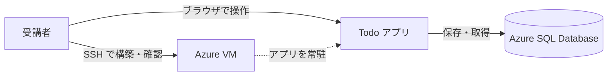

# 要件定義書

- 作成日: 2026-07-27
- 対象: Todo アプリ（Flask + Azure SQL Database）

## 1. 背景と目的

Udemy コース「作りながら覚える Microsoft Azure 入門講座（IaaS 編）」の再編にあたり、**受講者が Azure VM 上で実際に動かせる Web アプリ**を教材へ追加します。

コースは仮想マシン、仮想ネットワーク、ロードバランサ、仮想マシンスケールセットなどを扱います。**インフラを構築しただけでは「正しく動いているか」を確かめられません。** VM 上で動くアプリがあれば、次のことが目で見て分かります。

| 章の例                           | アプリがあると確認できること           |
| -------------------------------- | -------------------------------------- |
| 仮想マシン                       | 構築した VM でサービスが公開できている |
| ネットワークセキュリティグループ | 規則を変えると到達できなくなる         |
| ロードバランサ                   | 複数の VM へ振り分けられている         |
| 仮想マシンスケールセット         | 台数が増減しても同じ画面が表示される   |

このアプリ自体の機能は主題ではありません。**インフラの動作を確認するための、できるだけ小さな題材**として位置づけます。

## 2. 題材の選定

Todo アプリを採用します。理由は 3 つです。

- **データの登録・参照・更新・削除がひととおり含まれます。** データベースを伴う構成を扱えます
- **画面が 1 つで完結します。** 画面遷移の説明が不要です
- **動作の正誤が一目で分かります。** タスクが増えた、消えた、線が引かれた、で判断できます

## 3. 利用者と利用範囲

**利用者は受講者ひとりです。** ログイン認証はなく、URL に到達できる人は全員が同じデータを操作できます。

**アプリは 80 番でインターネットへ公開します。** 送信元 IP による制限は設けません。SSH（22 番）は許可した IP だけに絞ります。

**アクセス制御は URL を知られないことだけに依存します。** 到達した人は誰でもタスクを追加・削除できます。**確認が終わったら環境を削除してください。**

## 4. 機能要件

| ID  | 機能           | 内容                                             |
| --- | -------------- | ------------------------------------------------ |
| F-1 | 一覧表示       | 登録済みのタスクを作成日時の新しい順に表示します |
| F-2 | 追加           | タスク名を入力して登録します                     |
| F-3 | 完了状態の変更 | 完了・未完了を切り替えます                       |
| F-4 | 削除           | タスクを削除します                               |
| F-5 | 日時の表示     | 作成日時を日本時間で表示します                   |
| F-6 | 死活確認       | アプリが応答することを確認する経路を用意します   |
| F-7 | 実行環境の表示 | 応答した VM と接続先を画面の下部に表示します     |

### 補足

- **完了したタスクは取り消し線で表示します。** 一覧から消えません
- **作成日時はデータベースに UTC で保存し、表示時に日本時間へ変換します。** VM のタイムゾーン設定に依存させないためです
- **F-6 はデータベースに接続しません。** アプリの生死とデータベースの生死を切り分けるためです

### F-7 で表示する情報

**インフラの動作を確認するための機能です。** 一覧とエラーの案内の両方に、常に表示します。切り替える仕組みは持ちません。

| 項目            | 用途                                               |
| --------------- | -------------------------------------------------- |
| ホスト名        | どの VM が応答したかを見分けます                   |
| プライベート IP | 設計したサブネットの範囲に入っているか確認します   |
| DB 名           | 接続先のデータベースを取り違えていないか確認します |

**データベースのサーバー名・ユーザー名・パスワードは表示しません（S-11）。**

## 5. 非機能要件

| 区分         | 要件                                                                        |
| ------------ | --------------------------------------------------------------------------- |
| 可読性       | 教材の作成者が全体を把握できること。アプリ本体は 1 ファイルに収めます       |
| 構成の単純さ | Docker を使いません。仮想マシン上に直接構成します                           |
| 環境         | Azure VM（Ubuntu）で動作すること。受講者の作業は Cloud Shell で完結すること |
| 依存         | 実行時に必要なパッケージを 5 つ以内に抑えます                               |
| 再現性       | 依存のバージョンを固定し、受講者の環境で同じ結果になること                  |
| セキュリティ | 後述の最低限の要件を満たすこと                                              |

### 可読性を優先する理由

**入門講座のため、受講者がコードを読むことは前提にしません。** 受講者はアプリを配布された状態で動かし、インフラの動作を確認します。アプリの実装はコースの主題ではありません。

それでも可読性を優先するのは、次の 2 つの理由です。

| 理由                             | 内容                                                                                                   |
| -------------------------------- | ------------------------------------------------------------------------------------------------------ |
| **作成者が全体を把握できること** | 教材は数年にわたって使います。改訂や質問への回答のたびに、実装を思い出せる状態にしておく必要があります |
| 一部の受講者への配慮             | 中身を見る受講者も一定数います。見たときに追える状態にしておきます                                     |

**主たる読み手は作成者です。** そのため、次を優先します。

- 抽象化を持ち込みません。クラスやデザインパターンを使いません
- 処理の流れを 1 ファイルで追えるようにします
- コメントには「なぜそうしたか」を書きます

## 6. セキュリティ要件

| ID   | 要件                         | 内容                                                                |
| ---- | ---------------------------- | ------------------------------------------------------------------- |
| S-1  | 通信の暗号化                 | アプリとデータベースの間を TLS で暗号化します                       |
| S-2  | SQL インジェクション対策     | すべての問い合わせをパラメータ化します                              |
| S-3  | XSS 対策                     | 画面に出す値を自動エスケープします                                  |
| S-4  | 副作用のある GET の排除      | 追加・変更・削除はすべて POST で受けます                            |
| S-5  | 入力検証                     | 空文字と列長を超える入力をサーバー側で拒否します                    |
| S-6  | エラー情報の秘匿             | 例外の詳細は画面に出さず、サーバーのログへ記録します                |
| S-7  | 公開範囲の限定               | アプリはループバックだけで待ち受け、nginx 経由でのみ公開します      |
| S-8  | 実行権限の最小化             | root ではなく専用の低権限ユーザーで動かします                       |
| S-9  | 資格情報の保護               | 接続情報はリポジトリに含めず、VM 上では所有者のみ読める権限にします |
| S-10 | クロスサイトの書き込みの拒否 | 他サイトから送られた POST を拒否します                              |
| S-11 | 表示する情報の限定           | 画面にサーバー名・ユーザー名・パスワードを出しません（F-7）         |

**S-10 は CSRF 対策の一部です。** トークンは持ちませんが、ブラウザが付けるヘッダで他サイトからの書き込みを見分けます。判定方法は[設計書](design.md#設計上の約束)に記載します。

**S-11 は F-7 に対する制約です。** 画面に出した値は、その画面に到達できる人が全員読めます。データベースへ到達するための情報は表示しません。S-6 がエラーの詳細に対して定めていることを、常設の表示に対しても適用します。

**データベース名だけは表示します。** 接続先の取り違えに気づく手掛かりが必要なためです（F-7）。名前だけでは到達できません。

## 7. スコープ外

**次の項目は実装しません。** 教材の主題から外れるためです。

| 項目                       | 補足                                             |
| -------------------------- | ------------------------------------------------ |
| ログイン認証               | URL に到達できる人は誰でも操作できます           |
| HTTPS                      | ブラウザと VM の間は平文です                     |
| 利用者ごとのデータ分離     | 全員が同じ一覧を見ます                           |
| タスクの編集               | 追加と削除で代替します                           |
| 検索・並べ替え・ページング | 件数が少ない前提です                             |
| CSRF トークン              | 認証がなく、トークンを結び付ける対象がありません |

**CSRF はトークンを使わない範囲でのみ対策します（S-10）。** 完全な対策ではありません。

### 認証を持たないことの影響

**80 番をインターネットへ公開するため、URL に到達した人は誰でもタスクを操作できます。** 送信元 IP による制限を設けないので、アドレスを走査されれば発見され得ます。

| 起こり得ること                   | 起こらないこと                                       |
| -------------------------------- | ---------------------------------------------------- |
| タスクを読まれる                 | サーバー名・ユーザー名・パスワードを読まれる（S-11） |
| タスクを追加・削除される         | データベースへ直接接続される（規則で制限）           |
| データベースの無料枠を消費される | 料金が発生する（上限に達すると停止します）           |

**受け入れる前提は 2 つです。** 保存するのは動作確認用のタスクだけであること、環境が短命であることです。**個人情報や業務のデータを入力しないでください。**

### 環境を放置した場合の影響

**セクションが終わったらリソースを削除してください。** 一覧の表示はデータベースへ接続するため、外部からのアクセスが届き続けるとデータベースが自動的に一時停止しません。

**無料枠は 1 つのデータベースにつき月 100,000 vCore 秒です。** 停止しないまま**約 1.7 日**で使い切り、**使い切ると翌月までそのデータベースを使えません。** 料金は発生しませんが、復旧する手段もありません。

**セクションごとに環境を作り直す使い方であれば、この状態には至りません。**

**実運用に転用する場合は、少なくとも認証・HTTPS・CSRF 対策の 3 つが必要です。** どれか 1 つだけでは足りません。

## 8. 制約と前提

- データベースは Azure SQL Database（サーバーレス・無料オファー）を使います
- **無操作が続くとデータベースは自動的に一時停止します。** 停止からの復帰に約 1 分かかります
- **テーブルはアプリが作成します。** 管理者による事前の作成は不要です
- 受講者が作る環境は短命です。確認が終われば削除される前提とします

## 9. 関連文書

| 文書                                   | 内容                                   |
| -------------------------------------- | -------------------------------------- |
| [設計書](design.md)                    | 構成・ルーティング・テーブル・通信仕様 |
| [トラブルシュート](troubleshooting.md) | 症状別の対処                           |
| [README](../README.md)                 | 構築手順                               |
